<div align="center">

<picture>
  <source media="(prefers-color-scheme: dark)" srcset="assets/brand/png/lockup-horizontal-reverse.png">
  
</picture>

### 다중 에이전트 기반 광고 문구 준법 검수 · 생성 플랫폼

**"광고 한 줄이 나가기 전, 근거와 함께 먼저 검수합니다."**


-0F7B4F?style=flat-square)


**[📌 중간 발표 자료](발표자료/중간발표_2026-09-15/)** · [설계 결정 257건](docs/00_설계결정기록.md) · [사실 원장](docs/00_사실원장.md) · [고지](DISCLAIMER.md)

</div>

> [!WARNING]
> **이 도구는 「이 문구는 합법입니다」라고 말하지 않습니다.** 문장 단위 **1차 스크리닝**이며 법적 확정 판단이 아닙니다.
> 최종 판단은 심의기구 · 규제기관 · 법률 전문가의 검토를 따르십시오 — [DISCLAIMER.md](DISCLAIMER.md).
> 학술 · 교육 목적의 프로젝트 산출물이며, 라이선스는 선결 조건 미확정으로 **보류 중**입니다 (D-60).

---

## 문제

> *"종아리 독소 · 붓기 · 지방, 한 번에 해결!"*
> *"모근이 강화되어 머리가 빠지지 않습니다!"*

이 한 줄이 위법인지는 **조문을 찾아봐야** 압니다. 그런데 현장에서 그 일을 하는 사람은 대개 법률 전문가가 아니고, 조문은 **식품표시광고법 · 화장품법 · 건강기능식품법 · 표시광고법**에 흩어져 있습니다. 같은 표현도 제품 카테고리가 달라지면 판단이 뒤집힙니다.

기존 도구들은 **사후**에 걸리거나, 걸러도 **왜 걸렸는지**를 말해 주지 않습니다.

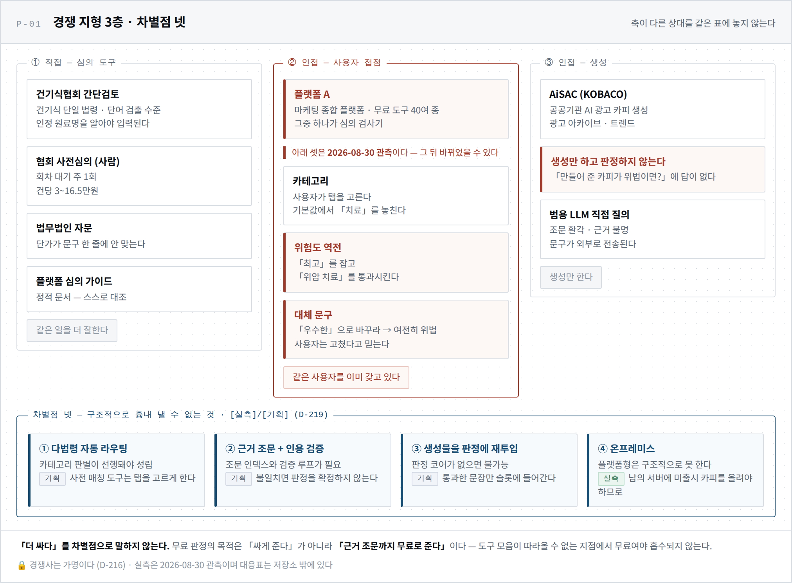

---

## 해법 — 경계는 법령이 정하고, 문구는 그 안에서 움직인다

이름의 **Lane** 이 그것입니다. 차선이탈방지(LKAS) 은유가 브랜드가 아니라 **설계 그 자체**입니다 (D-04) — 차선은 우리가 긋지 않고 **법령이** 긋습니다.

진입점은 셋이고, 🔴 **판정 코어는 하나**입니다. 어디로 들어오든 같은 기준으로 잽니다 (D-119 · D-181).

| | 진입점 | 하는 일 |
|:-:|---|---|
| **A** | **문구 검수** | 사용자가 쓴 문구를 문장 단위로 판정하고 **근거 조문**을 붙인다 |
| **B** | **카피 생성** | 위반 문장의 대체안을 만들고 **재판정을 통과한 것만** 내보낸다 |
| **C** | **AI 광고 생성** | 확정된 문구를 매체 지면에 배치한다. **「광고」 표시는 구조적으로 빠질 수 없다** |

B ↔ C 는 왕복입니다. C 가 매체 프로파일을 B 에 넘기고, B 의 각색본이 C 의 지면으로 돌아옵니다. 매체가 바꾸는 것은 **길이 · 문장 수 · 문체 · 표시 배치**뿐이며, **판정 기준 · 허용 어휘 · 근거 조문은 매체에 따라 달라지지 않습니다** (D-93).

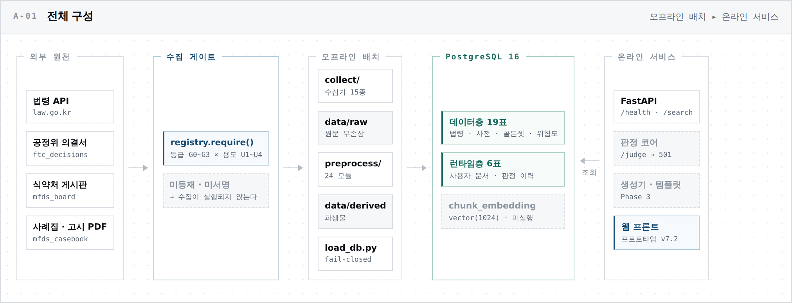

---

## 판정 코어 — 순서와 불변식

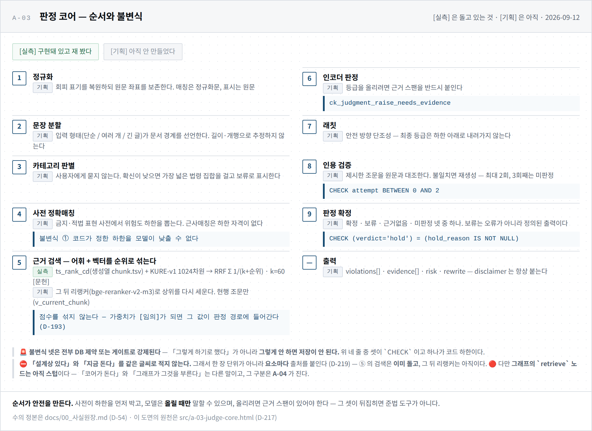

아홉 단계 중 셋은 **DB 제약으로 강제**됩니다. 「그렇게 하기로 했다」가 아니라 **그렇게 안 하면 저장이 안 됩니다.**

| | 불변식 | 강제 지점 |
|:-:|---|---|
| ① | **코드가 정한 하한을 모델이 낮출 수 없다** | 사전 정확매칭이 위험도 하한을 먼저 박는다 |
| ② | **인용을 검증하고, 3회째는 미판정** | `CHECK attempt BETWEEN 0 AND 2` |
| ③ | **보류에는 반드시 사유가 있다** | `CHECK (verdict='hold') = (hold_reason IS NOT NULL)` |
| ④ | **위험도를 올리려면 근거 스팬이 있어야 한다** | `ck_judgment_raise_needs_evidence` |

판정 결과는 통과/위반 둘이 아니라 **넷**입니다 — `confirmed` · `hold` · `no_basis` · `unjudged`. **미판정을 통과로 세지 않습니다** (D-125 · D-127). 위험도는 **R0~R3** 이고(R4 는 도달 불가 · D-227) 한 번 올라가면 내려오지 않습니다(래칫 · D-09).

<details>
<summary><b>검수 workflow · 재검수 게이트 · 판정 1회의 읽기/쓰기</b></summary>

<br>

**W-01 — 검수 workflow (화면 · API · DB)**

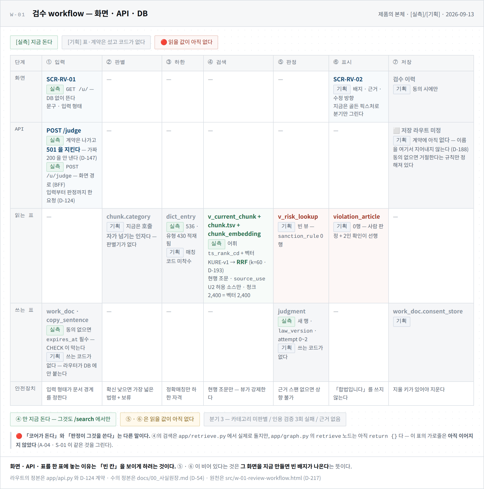

**W-02 — 재검수와 판정 게이트**

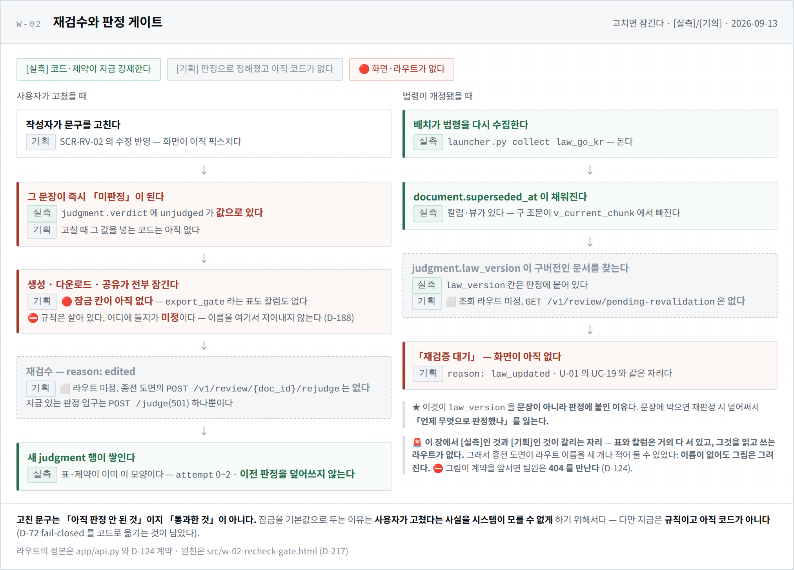

**S-01 — 판정 1회, 무엇을 읽고 무엇을 쓰는가**

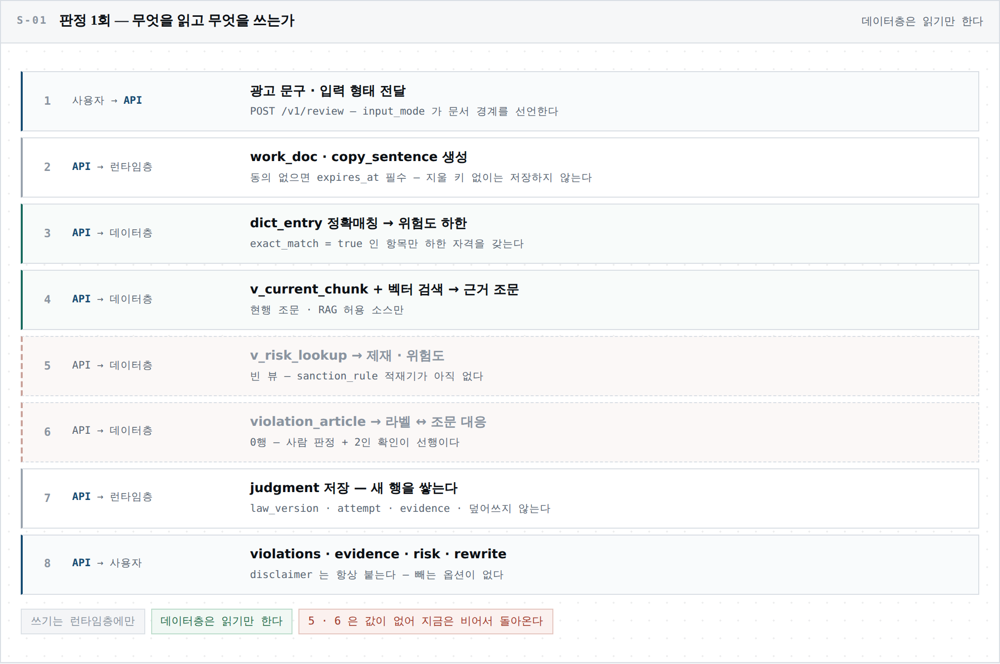

</details>

---

## 거버넌스가 코드 안에 있습니다

이 프로젝트의 중심은 모델이 아니라 **「그 판정을 믿어도 되는가」** 입니다.

**① 수집이 fail-closed 입니다.** 모든 수집기는 `registry.require(source_id, use=)` 로 시작합니다. 등급(G0~G3) × 용도(U1 학습 / U2 RAG / U3 인용 / U4 배포)가 허용하지 않으면 **첫 줄에서 거부**합니다. 등급 판정에는 **2인 확인 서명**이 필요하고, 서명이 없으면 수집 자체가 안 됩니다. 원천이 신고한 건수보다 덜 받았으면 「수집 완료」로 기록하지 않습니다.

**② 데이터의 위치가 곧 권한입니다.** `g3/` · `g2_facts/` · `g2_norepub/` · `quarantine/` — 디렉터리가 게이트입니다. 재배포 금지 자료는 물리적으로 다른 곳에 있고, 미판정 자료는 **어떤 스크립트도 읽지 않습니다**.

**③ 근거 없는 판정을 내지 않습니다.** 위험도를 올리려면 근거 스팬이 있어야 하고, 그것을 DB 제약이 강제합니다.

**④ 모르는 것은 모른다고 적습니다.** 평가 표본이 유형별 30건 미만이면 **「측정 불가」**로 표기합니다 — 좋다는 뜻도 나쁘다는 뜻도 아닌, 아무것도 모른다는 뜻입니다 (D-40).

**⑤ 평가셋은 봉인합니다.** 학습에 쓰지 않는 것은 물론이고 **채점 규칙을 고르는 재료로도** 쓰지 않습니다 (D-175). 게이트 테스트가 유출을 검사합니다.

**⑥ 외부로 나가지 않습니다.** 판정 경로에 외부 트레이싱 도구를 쓰지 않습니다. 배제한 도구가 **전이 의존으로 딸려 들어오면 그래프 빌드가 멈춥니다** (D-184) — 「안 쓴다」는 약속이 아니라 구조입니다.

<details>
<summary><b>등급 × 용도 판정 기준 · 수집 방식 · 소스에서 용도까지의 계보</b></summary>

<br>

**G-01 — 등급 × 용도 판정 기준**

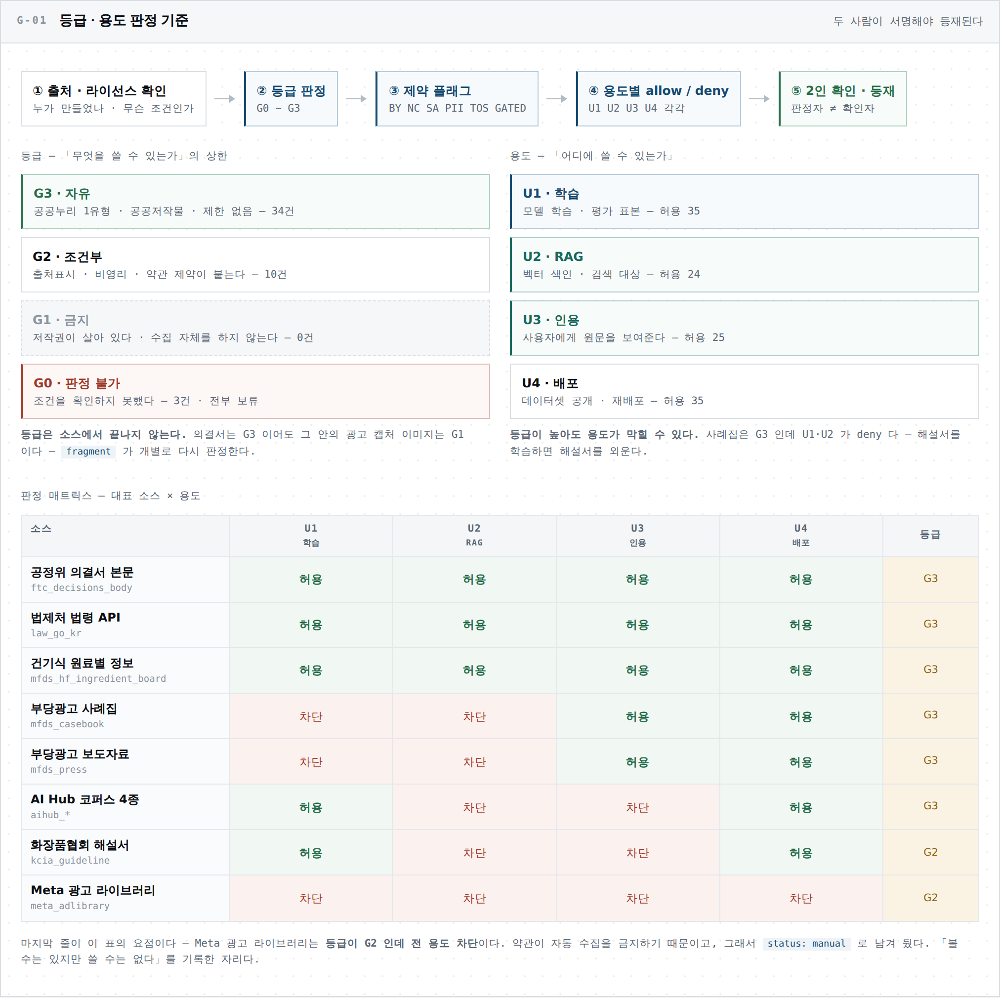

**A-02 — 수집 게이트**

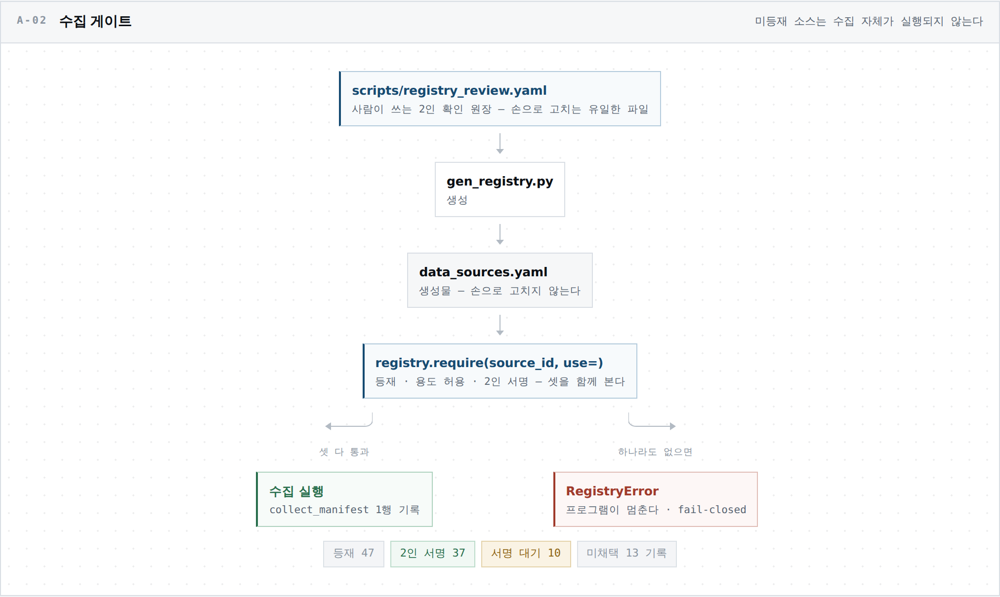

**G-03 — 소스 → 파생물 → 용도 계보**

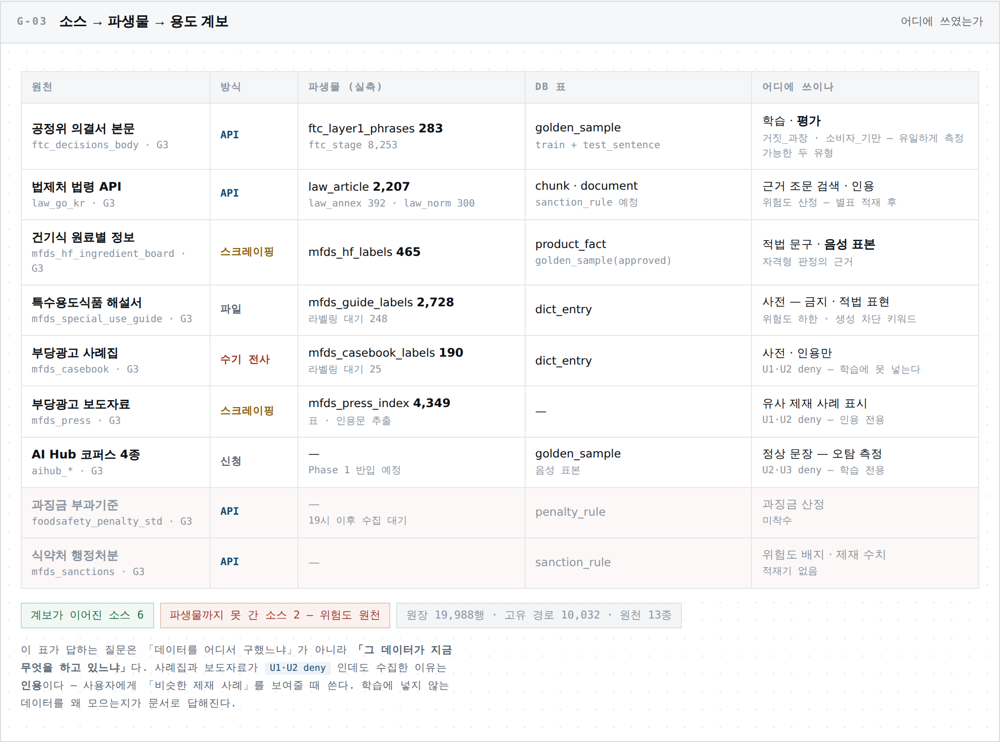

</details>

---

## 데이터 — 두 층으로 나눕니다

**데이터층 19표**(법령 · 사전 · 골든셋 · 위험도)와 **런타임층 7표**(사용자가 쓴 것 + 계정)를 분리하고, **두 층 사이에 FK 를 두지 않습니다.** 사용자 데이터가 판정 근거를 오염시킬 경로 자체를 없애기 위함입니다.

검색은 **pgvector(KURE-v1 · 1024차원) → bge-reranker-v2-m3** 2단이고, 생성은 **Qwen3 4B + LoRA** 를 계획하고 있습니다.

<details>
<summary><b>데이터층 19표 · 런타임층 7표 · VectorDB 구조 · 데이터 3분류</b></summary>

<br>

**E-01 — 데이터층 19표, 등급이 흐르는 뼈대**

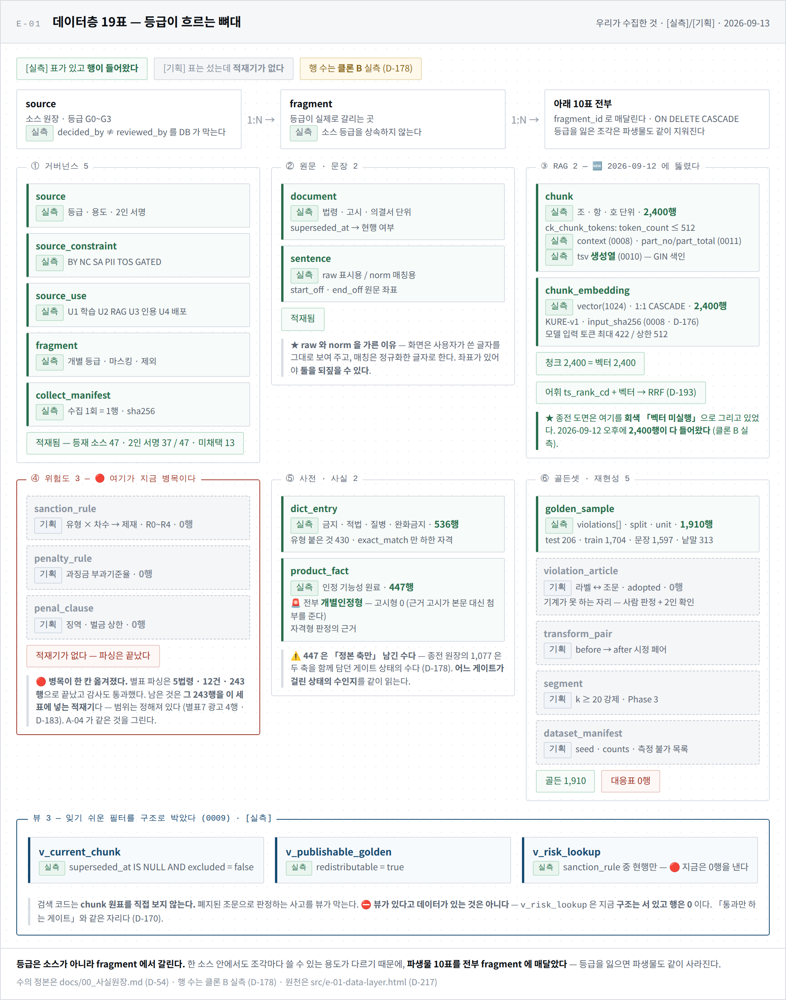

**E-02 — 런타임층 7표, 사용자가 쓴 것**

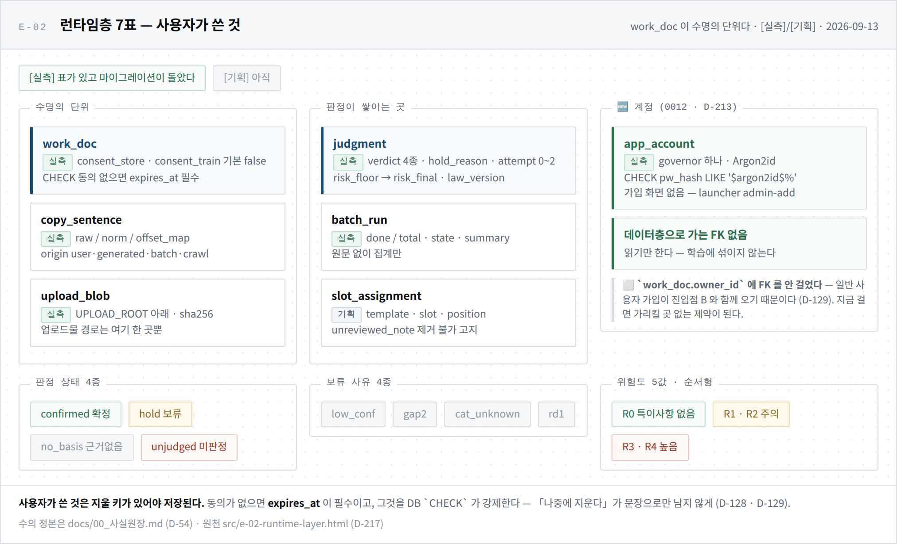

**E-03 — VectorDB 구조**

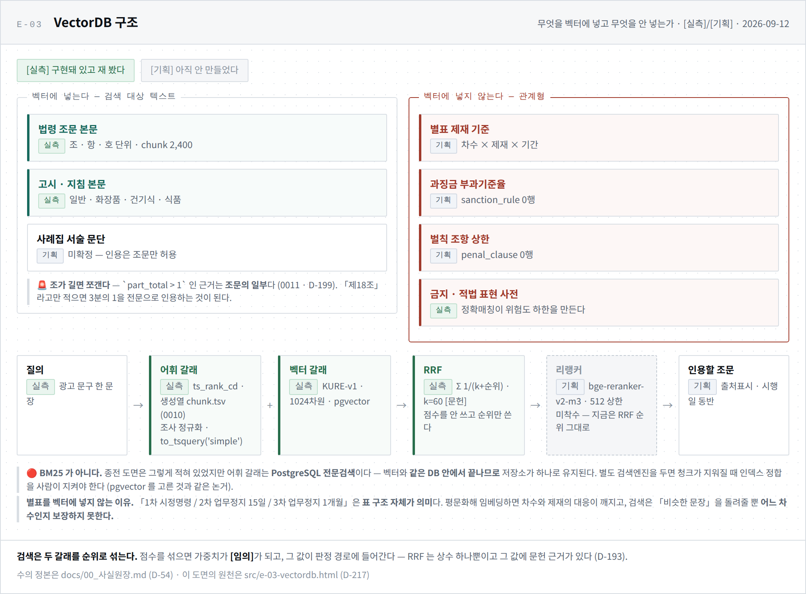

**D-01 — 학습 · RAG · 업무활용 3분류**

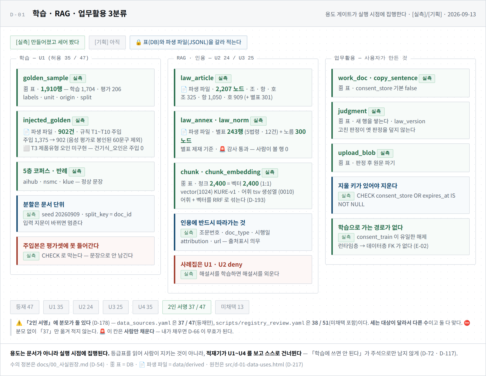

</details>

---

## 정직함이 기능입니다

**막힌 구간을 그려서 남깁니다.** 「설계상 있다」와 「지금 돈다」를 같은 글씨로 적지 않습니다.

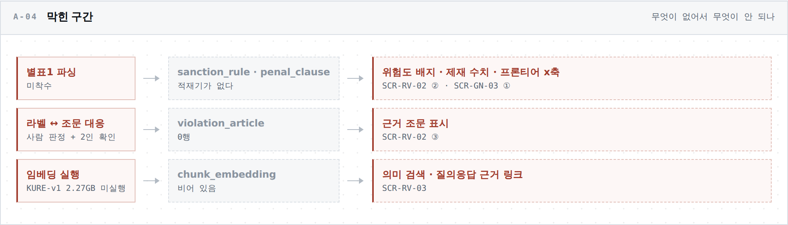

**평가 표본이 모자란 유형은 「측정 불가」로 둡니다.** 숫자를 만들어 채우지 않습니다.

<details>
<summary><b>위반 유형별 평가 표본 — 무엇을 아직 잴 수 없는가</b></summary>

<br>

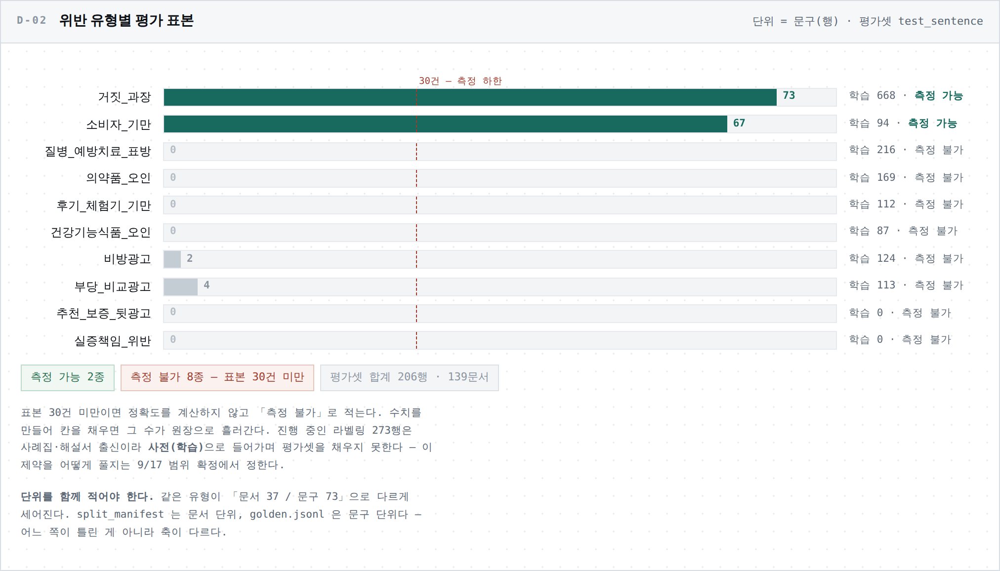

</details>

---

## 지금 무엇이 도는가

> 아래는 **2026-09-12 밤 실측**(클론 B)이고 🔄 표시한 칸만 그 뒤(**09-14~09-16** · 클론 A)입니다. 수치의 단일 출처는 [`docs/00_사실원장.md`](docs/00_사실원장.md) 이며 이 표는 사본입니다 (D-54).

| 구성요소 | 상태 | 실측 |
|---|:-:|---|
| 수집 · 거버넌스 게이트 | 🟢 **동작** | 소스 **47** 등재(수집 **31** · 보류 **12** · 수기 4) + 검토 예정 2 · 미채택 14 · 2인 서명 **39/47** · 수집 원장 약 25,500행 |
| 법령 별표 파싱 | 🟢 **동작** | 5법령 **12건 · 243행** · 감사 통과 |
| 전처리 · 골든셋 | 🟢 **동작** | 금지 표현 사전 **536종** · 결함 주입 7규칙 |
| DB — 데이터층 19표 + 런타임층 7표 | 🟢 **동작** | 마이그레이션 🔄 **0015** · `chunk` **2,400** = `chunk_embedding` **2,400** |
| 임베딩 (KURE-v1) | 🟢 **동작** | **1024차원** 실측 확인 · `chunk_embedding` **2,400** |
| 판정 그래프 (LangGraph) | 🟡 **부분** | **한 바퀴 돈다** — 노드 11 · 라우터 2. 🔄 `retrieve` 가 검색 코어를 불러 문장마다 근거를 붙인다(09-14). 판정·위험도 로직은 스텁 — 전부 `unjudged` |
| 판정 API | 🟡 **부분** | 계약 스키마 **19종** · 고정 응답 **14건**. 본체는 `501` |
| 검색 — 벡터 + 어휘 하이브리드 | 🟢 **동작** | `pgvector` + `ts_rank_cd`(생성열 `chunk.tsv`) 를 **RRF** 로 섞은 한 순위 (D-193) |
| 거버넌스 콘솔 인증 | 🟢 **동작** | Argon2id(OWASP m=19456·t=2·p=1) · 세션 · CSRF · 시도 제한 (D-66 · D-213) |
| 리랭킹 (bge-reranker-v2-m3) | 🔴 **미착수** | 하이브리드까지 섰고 3층은 아직 |
| 파인튜닝 · 평가 | 🔴 **미착수** | 평가 홀드아웃 4유형 공백 |

```
게이트 테스트   pytest -m gate   645건   ← 모은 수(--collect-only) · 2026-09-21
전체 테스트     pytest           1,257건 ← 데이터 없는 기기는 일부가 건너뛴다
설계 결정       D-01 ~ D-257     빠진 번호 0
```

---

## 빠르게 돌려 보기

```bash
git clone https://github.com/SKNETWORKS-FAMILY-AICAMP/SKN32-FINAL-3TEAM.git
cd SKN32-FINAL-3TEAM
setup.bat          # Windows — 더블클릭
uv run python launcher.py onboard    # 새 기기 — 세우고 **끝에 판정합니다**
```

uv · Python 3.11.9 · 의존성 · 커밋 훅 · `.env` 틀 · 로컬 DB 컨테이너가 한 번에 섭니다. **여러 번 실행해도 안전합니다**(멱등).

🚨 **`onboard` 는 안내가 아니라 실행입니다** — 패키지·훅·`.env` 를 세우고 **DB 를 띄워
마이그레이션까지 돌린 뒤**, `doctor --env` 로 판정해 **그 종료코드를 냅니다.** 빨강이면 1 입니다.
⛔ 못 하는 셋은 이름으로만 냅니다 — `.env` 키(D-111) · `data/raw` 원문(D-19) · `git`.
★ 아무것도 바꾸지 않고 보려면 `onboard --check`.

```bash
uv run python launcher.py            # 대화형 메뉴
uv run python launcher.py doctor     # 이 기기의 상태 진단
uv run python launcher.py gate       # 거버넌스 게이트 (수의 정본은 사실원장 · D-54)
uv run python launcher.py db-up      # 로컬 DB — 127.0.0.1 만 바인딩
uv run python launcher.py serve      # FastAPI
```

> [!IMPORTANT]
> **데이터는 이 저장소에 없습니다.** `data/**` 는 커밋되지 않습니다 — 재배포가 제한된 자료가 섞여 있고, G2 자료는 사실 추출 후 원본을 지우는 것이 규칙입니다 (D-92 · D-19). 🔄 그 삭제 경로가 붙기 전까지 **G2 는 수집 자체가 거부됩니다**(`registry.require` · 2026-09-21).
>
> | 클론 직후 | |
> |---|---|
> | 🟢 되는 것 | 게이트 테스트 · DB 스키마 · API 기동 · **고정 응답 14건**(`GET /fixtures`) · 문서 전부 |
> | 🔴 안 되는 것 | 실제 판정 · 검색 · 학습 — 수집을 거쳐야 합니다 |
>
> 커밋되는 것은 **원장 둘**(`data/manifest.jsonl` 수집 원장 · `data/derived_manifest.jsonl` 파생물 원장)과 골든셋 분할표뿐입니다. 무엇을 언제 어디서 받아 `sha256` 이 무엇이었는지가 거기 있습니다 — **내용 없이 이력만** 남깁니다. 파생물 파일은 팀 비공개 저장소가 옮깁니다 (D-247 · D-249).
>
> 수집에는 각자 발급받은 API 키(`launcher.py setkey`)와 **2인 확인 서명**이 필요합니다. 🚨 키 값을 셸 인자로 넘기지 마십시오 — 셸 기록에 남습니다. `.env` 가 유일한 입구입니다.

### 데이터 — 누가 무엇을 치나

기기마다 **역할**이 하나입니다. 처음 한 번 `data-setup` 이 역할·폴더를 `.env` 에 적습니다(손으로 열지 않습니다).
파생물을 **만드는** 명령은 정본에서만 돌고, 다른 기기에서는 이유와 할 일을 말하고 멈춥니다 (D-226).

| 역할 | 누구 | 처음 한 번 | 평소 |
|---|---|---|---|
| **정본** | 클론 B 한 대 | `data-setup --role canonical` | `collect` → `data-refresh <원천>` → `data-publish` → 원장 커밋·push → `load` · 🆕 원문 거울 `raw-mirror-publish` (D-256) |
| **사본** | 클론 A · 팀원 · 서버 | `data-setup` | `git pull` 뒤 그냥 쓴다 — `load`·`chunk`·`embed` 가 부족한 파생물을 **스스로 받는다** (`data-sync`) · 🆕 팀장 기기만 `data-setup --mirror` → `raw-mirror-sync` 로 원문을 받아 `extract <원천> --preview` (D-256 · 파생물은 안 바꾼다) |
| **수집 팀원** | 사본 + 수집 | `data-setup --device <별칭>` | `collect` → `raw-publish` → 수집 원장을 **자기 브랜치**에 push → 팀장이 `raw-import --from <브랜치>` 로 검사·병합·`raw-import` |

🚨 별칭은 팀 회의로 겹치지 않게 정하고 **실명을 쓰지 않습니다** — 수집 원장은 이 공개 저장소에 올라갑니다.
🚨 별칭은 **기기마다 하나**입니다 — 한 사람이 기기 두 대로 수집하면 계정은 그대로, 별칭만 둘(`collector-1a` · `collector-1b`). 같은 별칭을 두 기기에 쓰면 서로 받은 원문을 잃어버린 것으로 보고 **다시 받습니다** (D-250). `raw-publish` 는 기기마다 따로 칩니다.
🚨 공유 폴더(Drive)는 초대받은 계정만 엽니다. 폴더 이름을 알아도 들어갈 수 없습니다. 키는 `.env` 에만 있고 원문에 키가 섞이면 올리기가 멈춥니다.

---

## 저장소 구조

<details>
<summary><b>펼쳐 보기</b></summary>

<br>

```
├── launcher.py            ★ 작업 진입점 — 대화형 메뉴 + 직접 실행
├── setup.bat / setup.ps1  부트스트랩 (환경 · 훅 · DB · 게이트)
├── app/                   FastAPI · 판정 계약(Pydantic) · LangGraph 그래프
│   ├── settings.py        ★ 접속·판정 파라미터의 단일 출처 (D-209)
│   ├── logging_conf.py    🔴 로그 마스킹 — 문구가 로그에 안 실린다 (D-210)
│   ├── auth.py            🔴 governor 로그인 — Argon2id · 세션 · CSRF (D-66 · D-213)
│   ├── routers/           화면·BFF — **사람별 파일** user.py · admin.py · auth.py (D-208)
│   ├── templates/         Jinja2 — base.html(팀장) · user/ · admin/ · auth/
│   └── static/            base.css · vendor/ (외부 스크립트는 받아서 커밋)
├── collect/               수집기 — registry 게이트 · 무손상 저장 · 원장 append
├── preprocess/            추출 · 정규화 · 마스킹 · 청킹
├── scripts/               doctor · load_db · embed · golden · 레지스트리 생성기
├── db/                    schema.sql (데이터층 19표) + migrations/
├── alembic/               런타임층 마이그레이션
├── tests/                 🔴 거버넌스 게이트 — 저장소 구조를 코드가 검사한다
├── data/                  🚨 등급별 물리 분리 — 위치가 곧 게이트 (내용 미커밋)
│   ├── manifest.jsonl     수집 원장 (유일하게 커밋되는 것)
│   ├── raw/               무손상 원본 · 소비 금지
│   ├── derived/           파생물 — 사전 · 골든셋 · 청크
│   ├── g3/ g2_facts/ g2_norepub/ quarantine/
│   └── .g1_blocked/       빈 디렉터리 — 존재 자체가 「배제했다」는 기록
├── data_sources.yaml      소스 레지스트리 (생성물 — 판정 매트릭스에서 만든다)
├── assets/brand/          브랜드 자산 · assets/diagrams/ 도면 21장
├── 발표자료/               📌 발표용 제출 문서
└── docs/                  ★ 아래 참조
```

</details>

---

## 문서

**결정과 사실을 각각 한 파일에** 모읍니다. 값을 옮겨 적지 않고, 결정은 `D-XX` 번호로만 지칭합니다.

| 문서 | 무엇인가 |
|---|---|
| [`docs/00_사실원장.md`](docs/00_사실원장.md) | ★ **수치 · 일정 · 파라미터의 단일 출처.** 전부 실측이고, 어느 기기에서 쟀는지까지 적습니다 |
| [`docs/00_설계결정기록.md`](docs/00_설계결정기록.md) | ★ **결정 257건**(D-01~D-257 · 빠진 번호 0). 맥락 · 대안 · 트레이드오프 · 왜 기각했는지 |
| [`docs/00_거버넌스_집행계약.md`](docs/00_거버넌스_집행계약.md) | 게이트가 무엇을 어떻게 막는지 |
| [`docs/00_산출물현황.md`](docs/00_산출물현황.md) | 산출물 현황 — 제출본은 여기서 빌드합니다 |
| [`docs/01_기획/`](docs/01_기획/) · [`02_설계/`](docs/02_설계/) · [`03_데이터/`](docs/03_데이터/) | 기획서 · DB 스키마 · 청킹 · LangGraph 상태 · 전처리 사양 |
| [`docs/04_보안/`](docs/04_보안/) · [`05_배포/`](docs/05_배포/) | 보안 점검 · 배포 계획 |
| [`assets/diagrams/`](assets/diagrams/) | 도면 21장 — 번호가 식별자 |

### 읽을거리로서의 설계 원칙

결정기록을 처음 여신다면 이 여섯이 이 프로젝트의 성격을 가장 잘 보여 줍니다.

| | |
|---|---|
| **D-54** | 수치는 한 곳에서만 정의한다 — 옮겨 적는 순간 최신화 비용이 문서 수만큼 는다 |
| **D-220** | **없음이 성공으로 집계되지 않는다** — fail-closed. 🚨 이 규칙이 오래 **D-72 로 잘못 인용**돼 있었다 |
| **D-40** | 표본 30건 미만은 **「측정 불가」** — 좋다고도 나쁘다고도 적지 않는다 |
| **D-170** | **실패할 수 없는 단언을 쓰지 않는다** — 항상 통과하는 테스트는 검사가 아니다 |
| **D-175** | 평가셋은 **채점 규칙을 고르는 데도** 쓰지 않는다 |
| **D-178** | 원장의 수에는 **어느 게이트가 걸린 상태의 수인가**를 함께 적는다 |

---

## 팀

**SKN Final Project · 3팀 「한끗」 · 5인**

| 역할 | |
|---|---|
| **오한빈** (팀장) | 파이프라인 전체 — 수집 · 전처리 · DB · 임베딩 · 판정 코어 API |
| **권소라** · **이서은** | 유저 화면 · 유저 BFF · AI 광고 생성 |
| **소성민** · **박수진** | 관리자 화면 · 관리자 BFF |

이니셜이 작업 브랜치명이자 개인 문서 폴더명입니다 (`ohb` `ksr` `lse` `ssm` `psj`).

---

## 고지 · 라이선스

- **[DISCLAIMER.md](DISCLAIMER.md)** — 이 도구가 무엇이 아닌지, 알려진 한계가 무엇인지. **사용 전 반드시 읽어 주십시오.**
- **라이선스 보류** (D-60). 라이선스 파일이 없는 동안 저작권법 기본값인 **「모든 권리 유보」**가 적용됩니다.
- 이 저장소의 코드는 **있는 그대로** 제공되며 어떤 보증도 하지 않습니다.
- 제재 사례의 **피심인 상호 · 대표자명 · 주소는 파생 데이터를 만들 때 마스킹**하며, 마스킹 전 원문은 이 저장소와 배포물에 포함되지 않습니다 (D-257). 이 프로젝트는 특정 사업자의 위법을 지목하거나 평판을 평가할 목적으로 만들어지지 않았습니다.
