<div align="center">

<picture>
  <source media="(prefers-color-scheme: dark)" srcset="assets/brand/png/lockup-horizontal-reverse.png">
  
</picture>

### 다중 에이전트 기반 광고 문구 준법 검수 · 생성 플랫폼

**"광고 한 줄이 나가기 전, 근거와 함께 먼저 검수합니다."**


-0F7B4F?style=flat-square)


**[📌 중간 발표 자료](발표자료/중간발표_2026-09-15/)** · [설계 결정 321건](docs/00_설계결정기록.md) · [사실 원장](docs/00_사실원장.md) · [고지](DISCLAIMER.md)

</div>

> [!WARNING]
> **이 도구는 「이 문구는 합법입니다」라고 말하지 않습니다.** 문장 단위 **1차 스크리닝**이며 법적 확정 판단이 아닙니다.
> 최종 판단은 심의기구 · 규제기관 · 법률 전문가의 검토를 따르십시오 — [DISCLAIMER.md](DISCLAIMER.md).
> 학술 · 교육 목적의 프로젝트 산출물이며, 라이선스는 선결 조건 미확정으로 **보류 중**입니다 (D-60).

---

## 문제

> *"종아리 독소 · 붓기 · 지방, 한 번에 해결!"*
> *"모근이 강화되어 머리가 빠지지 않습니다!"*

이 한 줄이 위법인지는 **조문을 찾아봐야** 압니다. 그런데 현장에서 그 일을 하는 사람은 대개 법률 전문가가 아니고, 조문은 **식품표시광고법 · 화장품법 · 건강기능식품법 · 표시광고법**에 흩어져 있습니다. 같은 표현도 제품 카테고리가 달라지면 판단이 뒤집힙니다.

기존 도구들은 **사후**에 걸리거나, 걸러도 **왜 걸렸는지**를 말해 주지 않습니다.

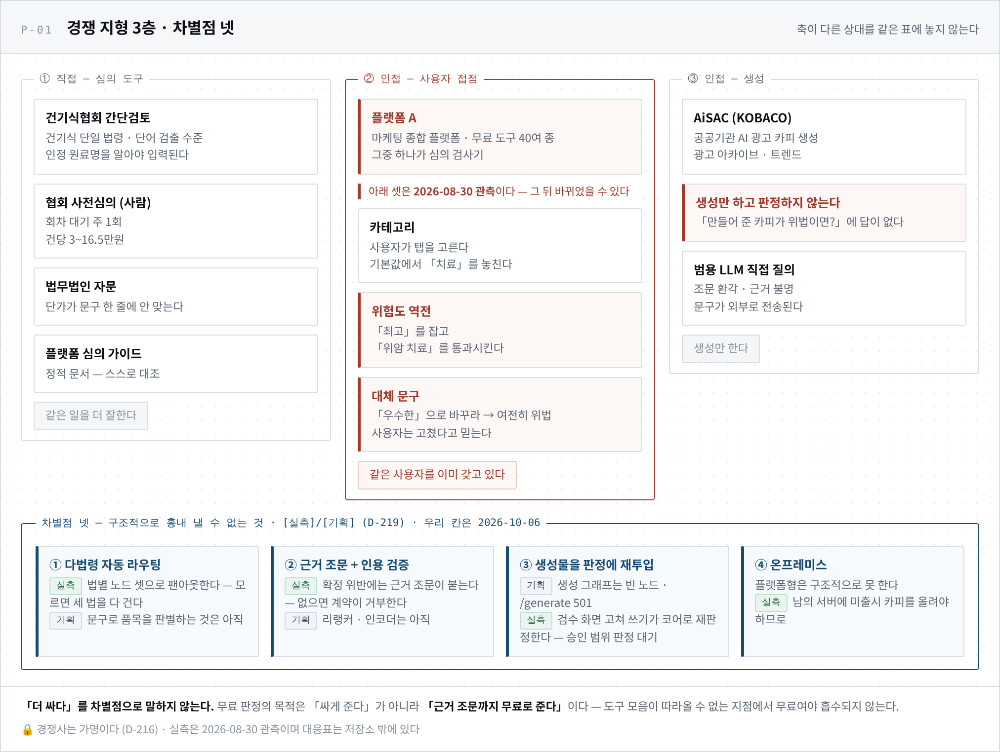

---

## 해법 — 경계는 법령이 정하고, 문구는 그 안에서 움직인다

이름의 **Lane** 이 그것입니다. 차선이탈방지(LKAS) 은유가 브랜드가 아니라 **설계 그 자체**입니다 (D-04) — 차선은 우리가 긋지 않고 **법령이** 긋습니다.

진입점은 셋이고, 🔴 **판정 코어는 하나**입니다. 어디로 들어오든 같은 기준으로 잽니다 (D-119 · D-181 · D-266).

| | 진입점 | 하는 일 | 2026-10-06 상태 |
|:-:|---|---|---|
| **A** | **문구 검수** | 사용자가 쓴 문구를 문장 단위로 판정하고 **근거 조문**을 붙인다. **대체 문구는 내지 않는다** — 뺄 구간 · 요건 안내 · 품목 전제별 분기까지다 (D-265) | 🟢 **동작** — `POST /judge` 가 검수 그래프를 실제 DB 로 돌린다 (인코더 전 규칙 판정) |
| **B** | **카피 생성** | 세그먼트 · 키워드 · 제품에서 출발해 **전제에 묶인 규칙 조립 후보**(삭제안 · 사실 진술 치환 · 인정 문구 슬롯 · 실증 유지)를 만들고, 후보마다 **자기 전제로 재판정**한 잔여 위험도를 붙인다 (D-264) | 🔴 **설계 · 미구현** — `POST /generate` 는 `501`, 생성 그래프의 노드는 빈 노드다 |
| **C** | **AI 광고 생성** | 문구를 매체 지면에 배치한다. **「광고」 표시가 없는 출력 경로를 두지 않는다** | 🔴 **설계 · 미구현** — `POST /compose` 는 `501`, 화면은 고정 응답으로만 뜬다 |

B ↔ C 는 왕복으로 **설계돼 있습니다** (D-181). C 가 매체 프로파일을 B 에 넘기고, B 의 각색본이 C 의 지면으로 돌아옵니다. 매체가 바꾸는 것은 **길이 · 문장 수 · 문체 · 표시 배치**뿐이며, **판정 기준 · 허용 어휘 · 근거 조문은 매체에 따라 달라지지 않습니다** (D-93).

> [!NOTE]
> **B · C 는 아직 돌지 않습니다.** 생성의 단계 관문은 10/13 입니다 (D-270 · ⚠️ 2026-10-06 「전제 정정 · 결론 재검 대기」 — 결론은 팀장 판정 전).
> 페르소나 · 세그먼트 · sLLM 다듬기 · 채널별 각색은 D-270 이 「설계만」으로 둔 범위입니다.
>
> **검수 화면의 「고쳐 쓰기」** — 2026-10-06 에 `lse` 브랜치의 작업이 `ohb` 에 병합됐습니다. 검수 화면의 `POST /u/review/rewrite` 가
> 로컬 sLLM 서버(`docs/lse/sllm_service.py` · `127.0.0.1:8765` · `Qwen/Qwen2.5-3B-Instruct` + LoRA · 별도 `.venv-sllm`)를 불러 지적 문장을 고쳐 쓰고,
> 고친 문구를 같은 판정 코어로 다시 판정합니다(`app/routers/sllm_client.py` · `app/routers/user.py`). 서버가 없으면 후보를 그리지 않습니다.
> 생성 그래프의 노드와 `POST /generate` · `/compose`(`501`)는 그대로입니다.
> ⬜ **이 기능과 D-265(검수는 대체 문구를 내지 않는다) · D-270(sLLM 은 설계만)의 관계, 승인 범위(실사용 / 시연)는 판정 대기입니다.**

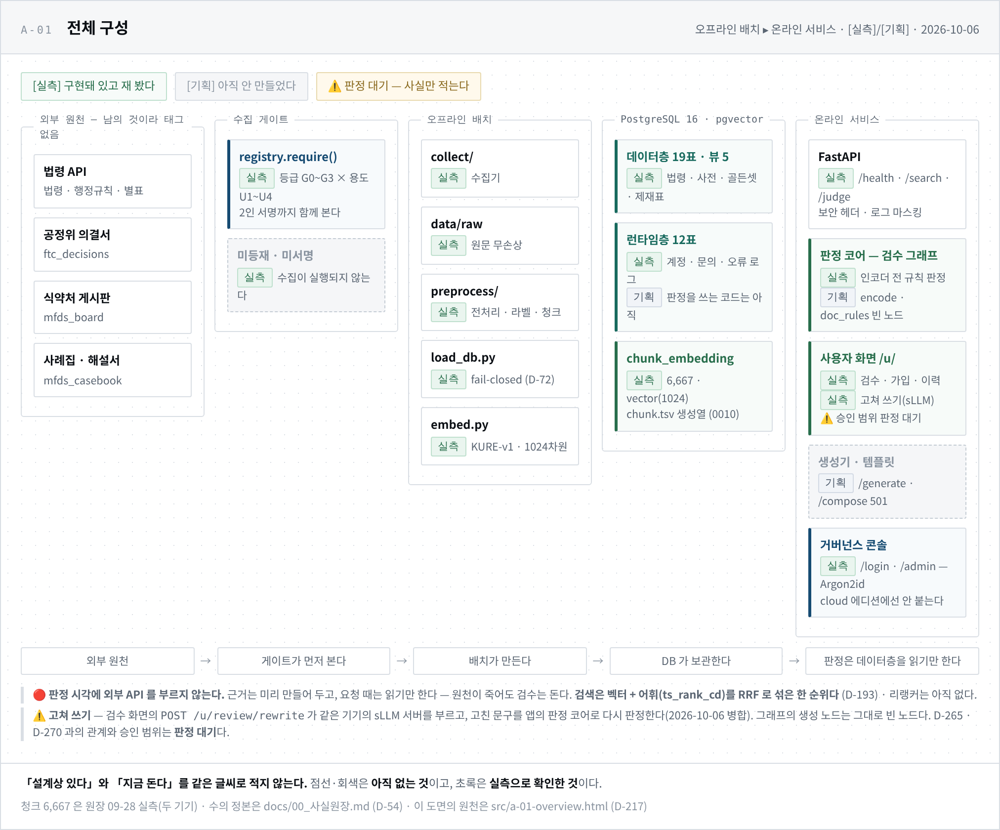

---

## 판정 코어 — 순서와 불변식

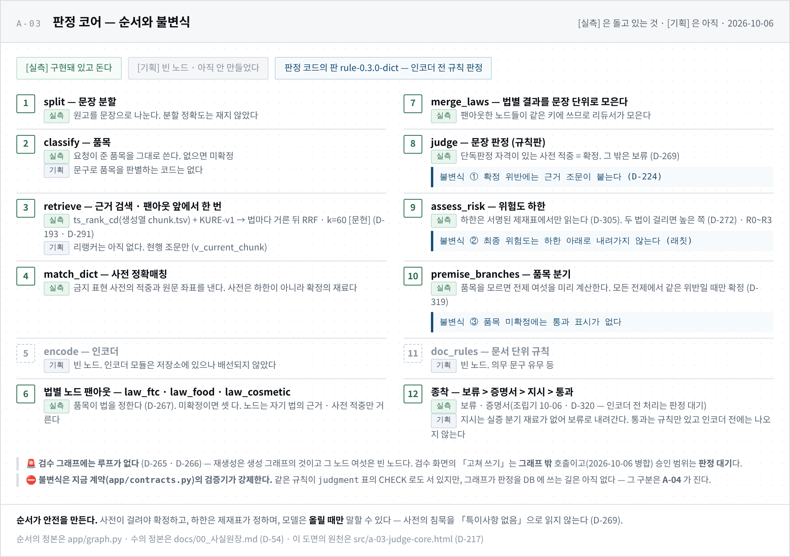

판정 코어는 **서브그래프 하나**이고 검수 · 생성 그래프가 같은 것을 부릅니다 (D-266). 순서의 정본은 `app/graph.py` 입니다.

```
split → classify → retrieve → match_dict → encode
      → 법별 노드 팬아웃 (표시광고법 · 식품표시광고법 · 화장품법 — 동시에 · D-267)
      → merge_laws → judge → assess_risk → premise_branches → doc_rules
```

| 노드 | 하는 일 | 2026-10-06 |
|---|---|---|
| `split` · `classify` | 문장 분할 · 받은 품목으로 적용할 법을 고른다(품목이 없으면 세 법 전부) | 🟢 |
| `retrieve` | 조문 검색 — 벡터 + 어휘 하이브리드, 문장마다 한 번 | 🟢 |
| `match_dict` | 금지 표현 사전 매칭 — 판정이 아니라 근거 후보 | 🟢 |
| `encode` | 판정 인코더(유형 · 근거 스팬 · 확신) | ⬜ **빈 노드** — 로더 `app/encoder.py`(KC-BERT)는 있으나 그래프에 붙지 않았다 |
| 법별 노드 · `merge_laws` | 법마다 자기 근거 · 사전 적중만 거르고, 빠진 법이 없는지 대조한다 | 🟢 |
| `judge` | **인코더 전 규칙 판정**(`rule-0.3.0-dict`) — 단독판정 자격이 있는 사전 적중만 위반 확정, 나머지는 보류 (D-269 · D-311) | 🟢 |
| `assess_risk` | 서명된 제재표에서 위험도 **하한**을 찾는다. 못 찾으면 적지 않는다 (D-305) | 🟢 |
| `premise_branches` | 품목을 모르면 전제마다 다시 판정해 **분기**를 내고, 기록은 가장 보수적인 쪽으로 (D-319) | 🟢 (10-06 켜짐) |
| `doc_rules` | 문서 단위 규칙 | ⬜ 빈 노드 |

검수 그래프의 종착은 **보류 · 증명서 · 지시 · 통과** 넷이고 **루프가 없습니다** (D-265 · D-268). 다만 지금 실제로 나오는 종착은 보류와 증명서(식품 품목 · 절대형)이고, 「지시」는 실증 분기 재료가 서기 전이라 보류로 내려갑니다. 통과는 **확정 ∧ R0(위반 없음)** 일 때만입니다 (D-273). 품목을 모르는 요청과 주된 광고법을 보지 않은 품목에는 통과 표시가 없습니다 (D-319 · D-277).

불변식은 **DB 제약과 계약 검증기가 강제**합니다. 「그렇게 하기로 했다」가 아니라 **그렇게 안 하면 저장이 안 됩니다.**

| | 불변식 | 강제 지점 |
|:-:|---|---|
| ① | **코드가 정한 하한을 모델이 낮출 수 없다** | `ck_judgment_final_not_below_floor` — 하한은 제재표(별표)에서만 온다 (D-09 · D-305) |
| ② | **재생성은 3라운드까지** | `CHECK attempt BETWEEN 0 AND 2` — 라운드는 **생성**의 것이고, 검수 응답은 계약이 `attempt = 0` 만 받는다 (D-265) |
| ③ | **보류에는 반드시 사유가 있다** | `CHECK (verdict='hold') = (hold_reason IS NOT NULL)` · 사유는 여섯 값 |
| ④ | **위험도를 올리려면 근거 스팬이 있어야 한다** | `ck_judgment_raise_needs_evidence` |

판정 결과는 통과/위반 둘이 아니라 **넷**입니다 — `confirmed` · `hold` · `no_basis` · `unjudged`. **미판정을 통과로 세지 않습니다** (D-127 · D-273). 위험도는 **R0~R3** 이고(R4 는 도달 불가 · D-227) 한 번 올라가면 내려오지 않습니다(래칫 · D-09).

<details>
<summary><b>검수 workflow · 재검수 게이트 · 판정 1회의 읽기/쓰기</b></summary>

<br>

**W-01 — 검수 workflow (화면 · API · DB)**

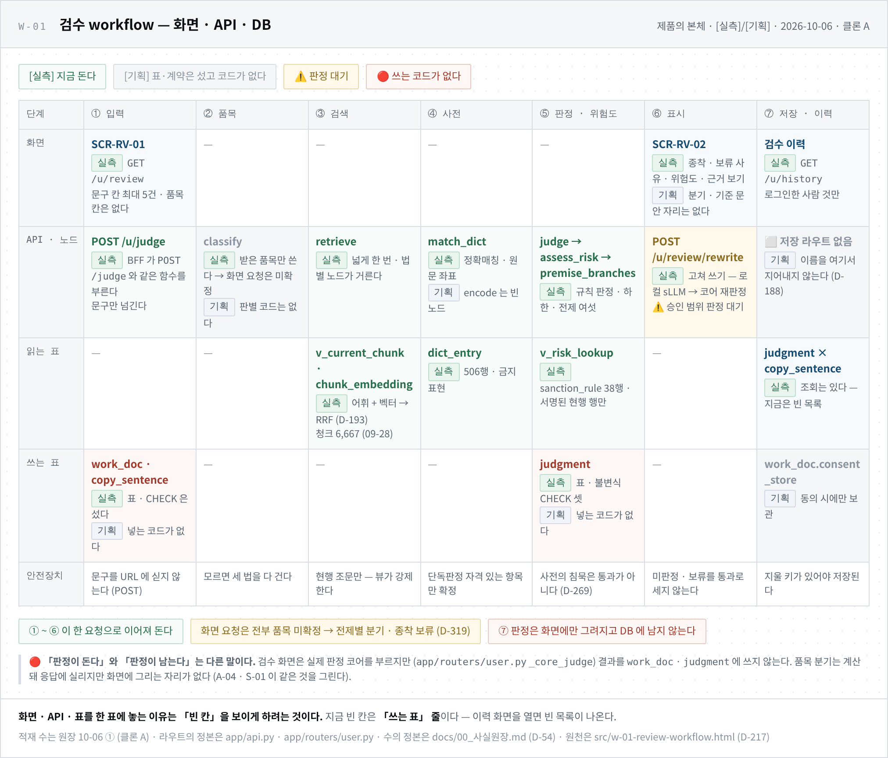

**W-02 — 재검수와 판정 게이트**

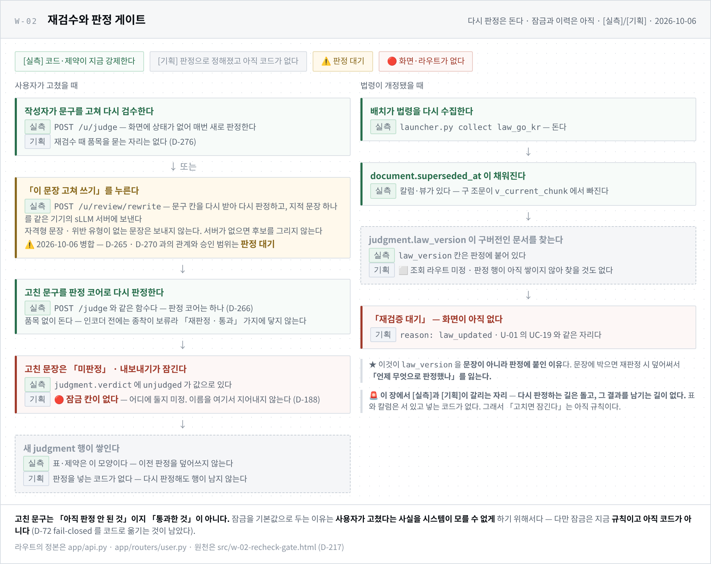

> 검수 화면은 지금 **판정을 DB 에 쓰지 않습니다** — 표와 제약은 서 있으나 넣는 코드가 없어 재검수 잠금과 이력은 `[기획]` 입니다(W-02 · S-01 · A-04).

**S-01 — 판정 1회, 무엇을 읽고 무엇을 쓰는가**

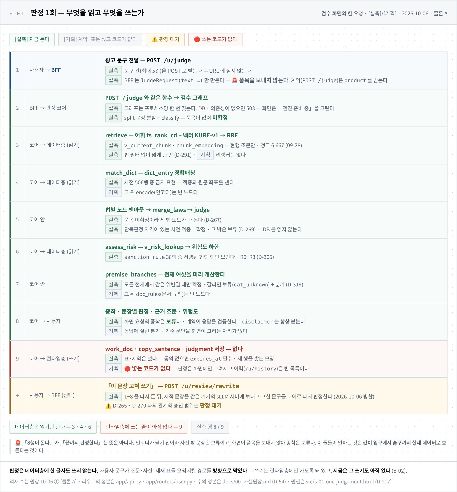

</details>

---

## 거버넌스가 코드 안에 있습니다

이 프로젝트의 중심은 모델이 아니라 **「그 판정을 믿어도 되는가」** 입니다.

**① 수집이 fail-closed 입니다.** 모든 수집기는 `registry.require(source_id, use=)` 로 시작합니다. 등급(G0~G3) × 용도(U1 학습 / U2 RAG / U3 인용 / U4 배포)가 허용하지 않으면 **첫 줄에서 거부**합니다. 등급 판정에는 **2인 확인 서명**이 필요하고, 서명이 없으면 수집 자체가 안 됩니다. 원천이 신고한 건수보다 덜 받았으면 「수집 완료」로 기록하지 않습니다.

**② 데이터의 위치가 곧 권한입니다.** `g3/` · `g2_facts/` · `g2_norepub/` · `quarantine/` — 디렉터리가 게이트입니다. 재배포 금지 자료는 물리적으로 다른 곳에 있고, 미판정 자료는 **어떤 스크립트도 읽지 않습니다**.

**③ 근거 없는 판정을 내지 않습니다.** 위험도를 올리려면 근거 스팬이 있어야 하고, 그것을 DB 제약이 강제합니다.

**④ 모르는 것은 모른다고 적습니다.** 평가 표본이 유형별 30건 미만이면 **「측정 불가」**로 표기합니다 — 좋다는 뜻도 나쁘다는 뜻도 아닌, 아무것도 모른다는 뜻입니다 (D-40).

**⑤ 평가셋은 봉인합니다.** 학습에 쓰지 않는 것은 물론이고 **채점 규칙을 고르는 재료로도** 쓰지 않습니다 (D-175). 게이트 테스트가 유출을 검사합니다.

**⑥ 외부로 나가지 않습니다.** 판정 경로에 외부 트레이싱 도구를 쓰지 않습니다. 배제한 도구가 **전이 의존으로 딸려 들어오면 그래프 빌드가 멈춥니다** (D-184) — 「안 쓴다」는 약속이 아니라 구조입니다.

<details>
<summary><b>등급 × 용도 판정 기준 · 수집 게이트 · 소스에서 용도까지의 계보</b></summary>

<br>

**G-01 — 등급 × 용도 판정 기준**

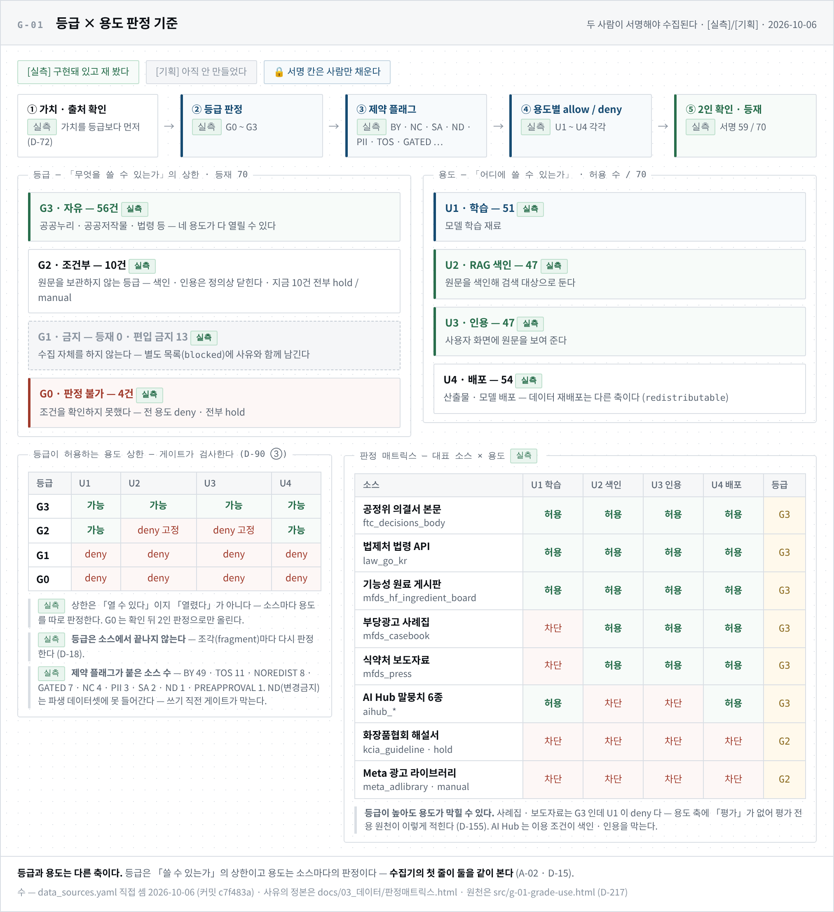

**A-02 — 수집 게이트**

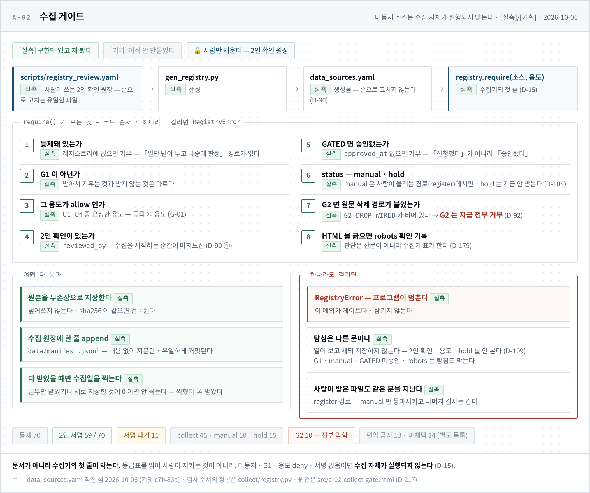

**G-03 — 소스 → 파생물 → 용도 계보**

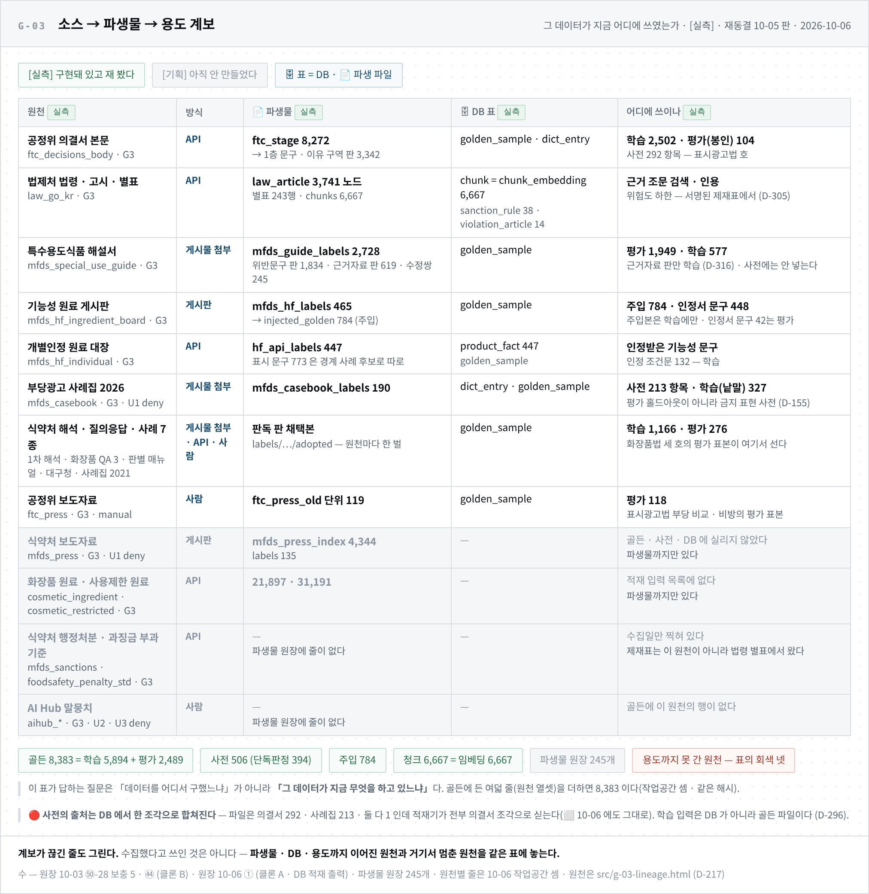

</details>

---

## 데이터 — 두 층으로 나눕니다

**데이터층 19표**(법령 · 사전 · 골든셋 · 위험도)와 **런타임층 12표**(사용자가 쓴 것 + 계정 · 운영)를 분리하고, **두 층 사이에 FK 를 두지 않습니다.** 사용자 데이터가 판정 근거를 오염시킬 경로 자체를 없애기 위함입니다.

모델은 셋으로 갈립니다.

| 자리 | 모델 | 2026-10-06 |
|---|---|---|
| 검색 임베딩 | **KURE-v1** (1024차원) · `pgvector` + 어휘(`ts_rank_cd`)를 **RRF** 로 섞은 한 순위 (D-193) | 🟢 동작. 리랭커(bge-reranker-v2-m3)는 **미구현** |
| 판정 인코더 | **KC-BERT** 파인튜닝 — 로더 `app/encoder.py` 는 「위반 후보 + 확신」만 내고 확정 · 위험도는 만들지 않는다 | ⬜ **그래프에 붙지 않았다**(`encode` 는 빈 노드). 가중치(`models/`)는 저장소에 없고, 재동결 10-05 판으로 재학습 대기 |
| 생성 sLLM | 모델 레지스트리(`data_sources.yaml` `models`) 등재는 **Qwen3 4B**. 병합된 고쳐 쓰기 서버가 실제로 쓰는 베이스는 **`Qwen/Qwen2.5-3B-Instruct` + LoRA** | ⬜ **미정 · 판정 대기** — Qwen2.5-3B 의 레지스트리 등재 · 라이선스 확인 |

<details>
<summary><b>데이터층 19표 · 런타임층 12표 · VectorDB 구조 · 데이터 3분류</b></summary>

<br>

**E-01 — 데이터층 19표, 등급이 흐르는 뼈대**

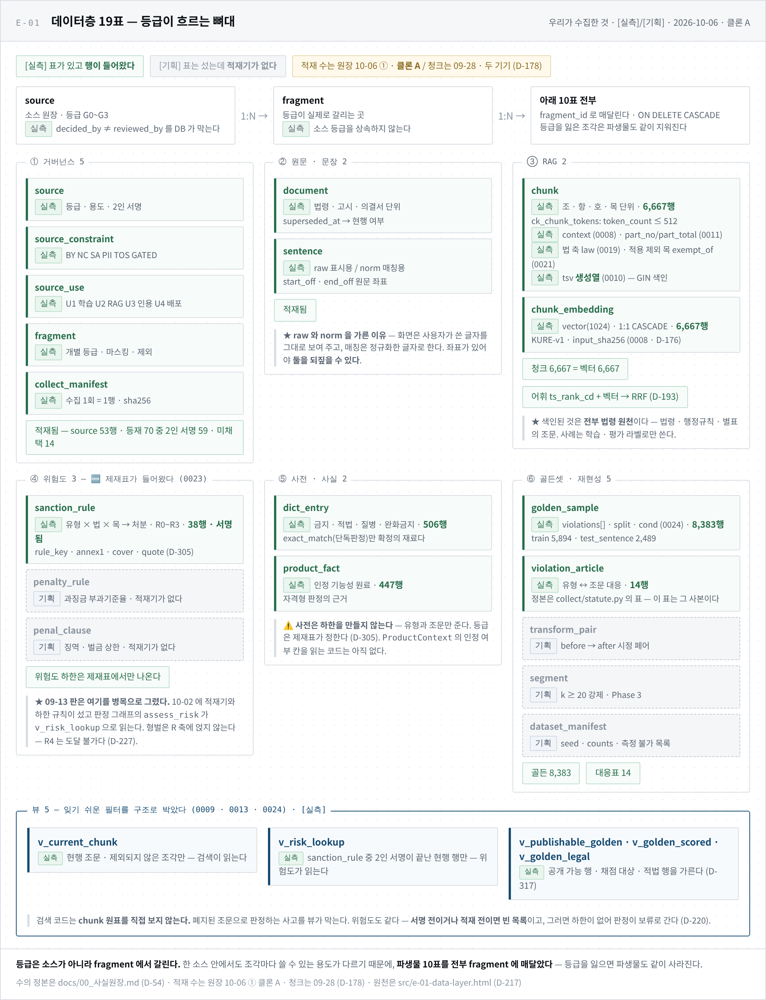

**E-02 — 런타임층 12표, 사용자가 쓴 것**

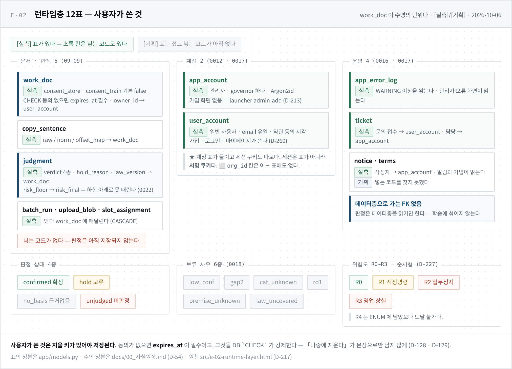

**E-03 — VectorDB 구조**

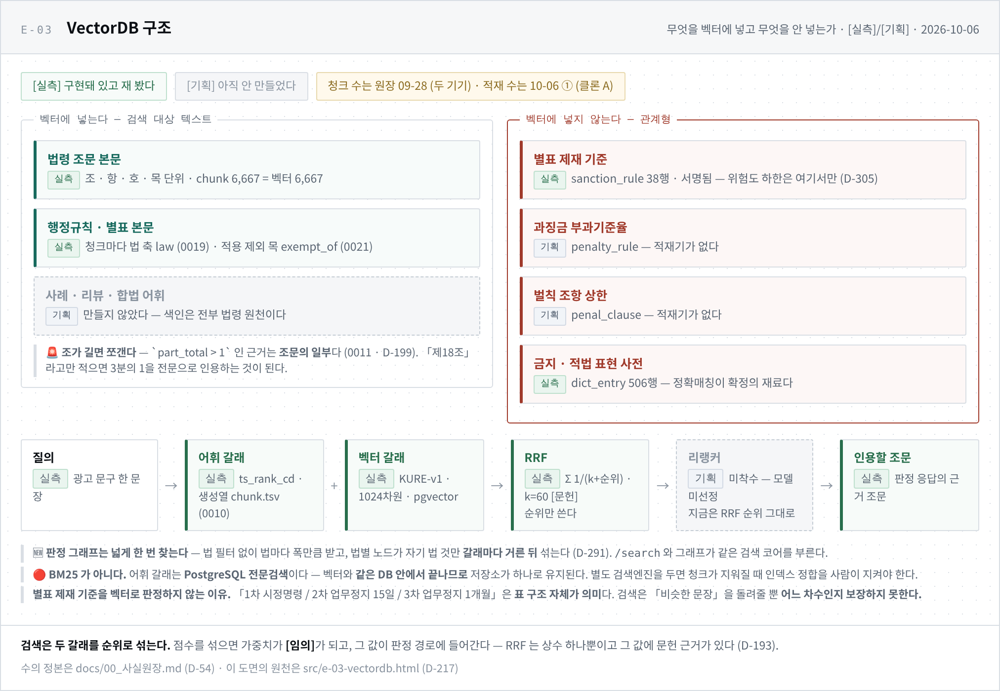

**D-01 — 학습 · RAG · 업무활용 3분류**

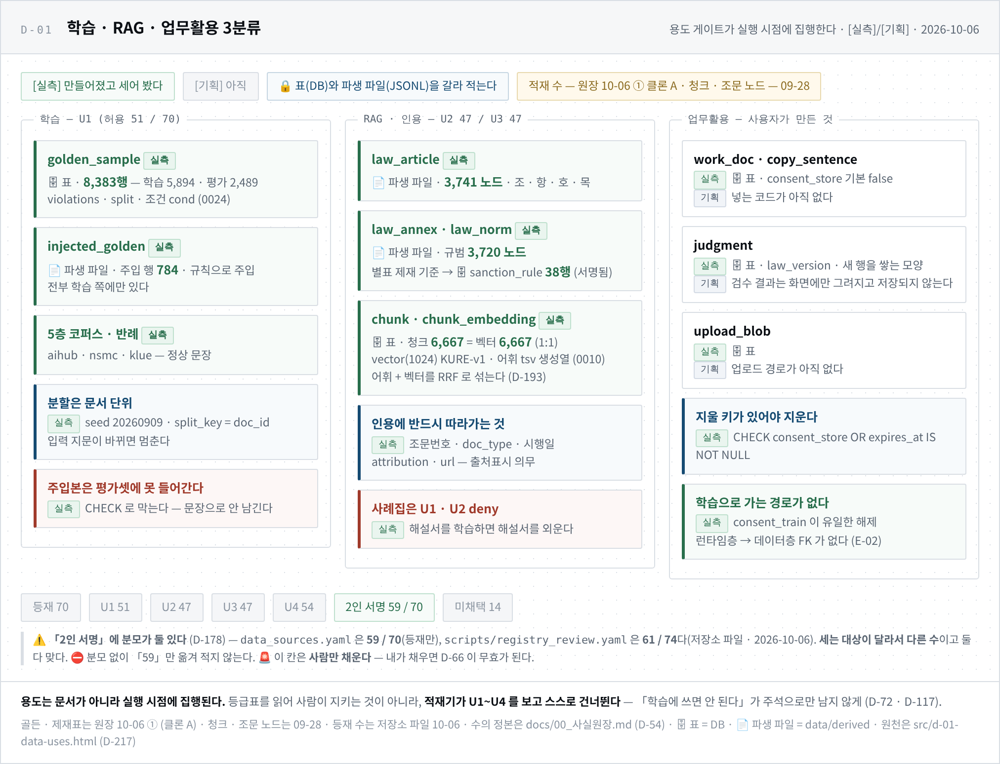

</details>

---

## 정직함이 기능입니다

**막힌 구간을 그려서 남깁니다.** 「설계상 있다」와 「지금 돈다」를 같은 글씨로 적지 않습니다.

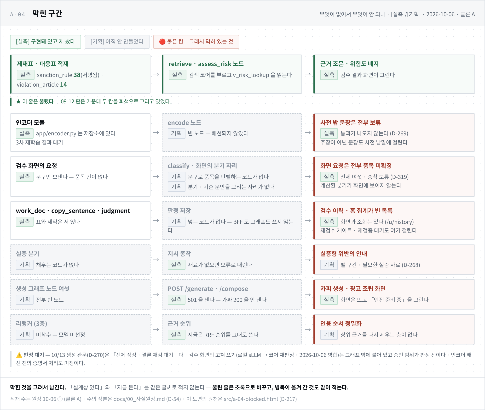

> 2026-10-06 기준입니다. 제재표 적재와 `retrieve` 는 뚫렸고, **지금 막힌 구간**은 인코더 배선(`encode`) · 화면이 품목을 보내지 않는 것 · 판정 저장 ·
> 실증 분기 · 생성 그래프(B · C) · 리랭커입니다.

**평가 표본이 모자란 호는 「측정 불가」로 둡니다.** 숫자를 만들어 채우지 않습니다.

<details>
<summary><b>위반 유형별 평가 표본 — 무엇을 아직 잴 수 없는가</b></summary>

<br>


> 표본은 유형이 아니라 **조문의 호 단위**로 셉니다(D-282). 평가 분할에서 서로 다른 글자가 30 에 못 미치는 호는 점수를 내지 않습니다(D-40) —
> 16호 중 **12호 측정 가능 · 4호 측정 불가**(원장 10-03 ㊿-38 · 클론 B · 재동결 10-05 판 · 라벨 분포만 센 것 · 이후 재측정 없음).
> 최신 수와 측정 불가 목록의 정본은 사실원장입니다.

</details>

---

## 지금 무엇이 도는가

> **기준일 2026-10-06.** 행마다 원장의 날짜 · 절 · 기기를 적었습니다. 기기가 둘(클론 A · 클론 B)이고 `data/` 는 커밋되지 않으므로 **한쪽 실측은 그 기기의 사실**입니다 (D-178).
> 수치의 단일 출처는 [`docs/00_사실원장.md`](docs/00_사실원장.md) 이며 이 표는 사본입니다 (D-54).

| 구성요소 | 상태 | 실측 |
|---|:-:|---|
| 수집 · 거버넌스 게이트 | 🟢 **동작** | 소스 **70** 등재(수집 **45** · 보류 **15** · 수기 **10**) · 미채택 14 · 2인 확인 칸이 찬 것 **59/70** — `data_sources.yaml` 을 센 수(10-06 · 기기 무관). 수집 원장 `data/manifest.jsonl` **28,276줄**(커밋본). DB 적재 `source` 53(건너뜀 17 — 2인 확인 미완 등) — 원장 10-06 ① · 클론 A |
| 법령 별표 파싱 | 🟢 **동작** | 5법령 **12건 · 243행** · 감사 통과 — 09-12 실측. ⬜ 10-06 기준 재확인 필요(그 뒤 같은 지표의 재측정을 찾지 못했다) |
| 전처리 · 골든셋 | 🟢 **동작** | 재동결 10-05 판 — 금지 표현 사전 **506종**(단독판정 자격 394) · 골든 적재 `golden_sample` **8,383**(학습 5,894 · 평가 2,489) · 결함 주입 784행 — 원장 10-06 ① · 클론 A(사전 · 골든 적재) / 10-03 ㊿-28 · ㊿-30 · 클론 B(주입 · 단독판정 자격) |
| DB — 데이터층 19표 + 런타임층 12표 | 🟢 **동작** | 마이그레이션 **0024** (원장 10-06 ① · 클론 A) · `chunk` **6,667** = `chunk_embedding` **6,667** (원장 09-28 · 클론 A · B — 그 뒤 재측정 없음) · 제재표 `sanction_rule` **38**(서명됨) · `violation_article` 14 (원장 10-06 ① · 클론 A) |
| 임베딩 (KURE-v1) | 🟢 **동작** | **1024차원** · `chunk_embedding` **6,667** (원장 09-28 · 클론 A · B) |
| 검색 — 벡터 + 어휘 하이브리드 | 🟢 **동작** | `pgvector` + `ts_rank_cd`(생성열 `chunk.tsv`) 를 **RRF** 로 섞은 한 순위 (D-193) |
| 판정 그래프 — 검수 (진입점 A) | 🟡 **부분** | **인코더 전 규칙 판정**(`rule-0.3.0-dict`)이 실제 DB 로 돈다 — 사전 적중 · 법별 팬아웃 · 위험도 하한 · 품목 분기(10-06 켜짐) · 증명서 조립. 인코더(`encode`)와 문서 규칙은 빈 노드. 봉인 평가 2,489행(품목 미확정 · 채점 1,819): 확정 위반 6행 · `cat_unknown` 보류 89 · **탐지 재현율 16.1%** · 적법 문장 오탐 0/143 · 종착은 전부 보류 — 원장 10-03 ㊿-40 보충 1 · 클론 B · 게이트 1,363 통과 상태. 🚨 **인코더가 붙기 전의 기준선**입니다 |
| 판정 API | 🟡 **부분** | `POST /judge` 는 검수 그래프를 돌린다(DB · 의존성이 없으면 `503`). `POST /generate` · `/compose` 는 `501`. 고정 응답 **21건**(judge 15 · generate 3 · compose 3) |
| 생성 그래프 (진입점 B) · 조립 (C) | 🔴 **설계 · 미구현** | 그래프 모양과 종착만 서 있고 노드는 빈 노드. 관문 10/13 (D-270 · ⚠️ 전제 정정 · 결론 재검 대기) |
| 검수 화면 「고쳐 쓰기」 (sLLM) | 🟡 **병합됨 · 판정 대기** | 10-06 `lse` → `ohb` 병합. 로컬 sLLM 서버가 떠 있을 때만 동작 · `tests/test_user_rewrite.py` 30 통과(게이트 표시 없음) — 원장 10-06 ② · 클론 A. 승인 범위 · D-265 · D-270 과의 관계는 **판정 대기** |
| 거버넌스 콘솔 인증 | 🟢 **동작** | Argon2id(OWASP m=19456·t=2·p=1) · 세션 · CSRF · 시도 제한 (D-66 · D-213) |
| 리랭킹 (bge-reranker-v2-m3) | 🔴 **미구현** | 하이브리드까지 섰고 3층은 아직 |
| 판정 인코더 파인튜닝 | 🟡 **진행 중** | `experiments/` 틀 밖에서 진행 — 작업 자료와 보고서는 `docs/psj/` · `docs/ssm/`. 재동결 10-05 판으로 재학습 · 봉인 test 결과 대기. **앱에는 아직 붙지 않았다** |
| sLLM 파인튜닝 | 🟡 **진행 중** | `docs/lse/` — LoRA 결과서(10-01) · 고쳐 쓰기 서버. 모델 레지스트리 등재 · 라이선스는 **미정 · 판정 대기** |
| 평가 | 🟡 **부분** | 그래프 평가 도구 `scripts/eval_graph.py` · 판정기 B `scripts/eval_rule.py` 가 봉인 평가셋에서 돈다. 호 단위 **측정 불가 넷**(표본 30 미만 · 원장 10-03 ㊿-23 · 클론 B — ⬜ 그 뒤 재동결 10-05 판에서의 수는 재확인 필요). 채점 규칙 · 10/13 F1 게이트 지표는 **미정 · 판정 대기** |

```
게이트 테스트   pytest -m gate   1,365건  ← 1,363 passed · 2 skipped · 원장 10-06 ① ② · 클론 A
전체 테스트     pytest           2,174건  ← 이 커밋에서 수집되는 수(2026-10-06) · 데이터 없는 기기는 일부가 건너뛴다
설계 결정       D-01 ~ D-321     빠진 번호 0
```

---

## 빠르게 돌려 보기

```bash
git clone https://github.com/SKNETWORKS-FAMILY-AICAMP/SKN32-FINAL-3TEAM.git
cd SKN32-FINAL-3TEAM
setup.bat          # Windows — 더블클릭
uv run python launcher.py onboard    # 새 기기 — 세우고 **끝에 판정합니다**
```

uv · Python 3.11.9 · 의존성 · 커밋 훅 · `.env` 틀 · 로컬 DB 컨테이너가 한 번에 섭니다. **여러 번 실행해도 안전합니다**(멱등).

🚨 **`onboard` 는 안내가 아니라 실행입니다** — 패키지·훅·`.env` 를 세우고 **DB 를 띄워
마이그레이션까지 돌린 뒤**, `doctor --env` 로 판정해 **그 종료코드를 냅니다.** 빨강이면 1 입니다.
⛔ 못 하는 셋은 이름으로만 냅니다 — `.env` 키(D-111) · `data/raw` 원문(D-19) · `git`.
★ 아무것도 바꾸지 않고 보려면 `onboard --check`.

```bash
uv run python launcher.py            # 대화형 메뉴
uv run python launcher.py doctor     # 이 기기의 상태 진단
uv run python launcher.py gate       # 거버넌스 게이트 (수의 정본은 사실원장 · D-54)
uv run python launcher.py db-up      # 로컬 DB — 127.0.0.1 만 바인딩
uv run python launcher.py serve      # FastAPI
```

> [!IMPORTANT]
> **데이터는 이 저장소에 없습니다.** `data/**` 는 커밋되지 않습니다 — 재배포가 제한된 자료가 섞여 있고, G2 자료는 사실 추출 후 원본을 지우는 것이 규칙입니다 (D-92 · D-19). 🔄 그 삭제 경로가 붙기 전까지 **G2 는 수집 자체가 거부됩니다**(`registry.require` · 2026-09-21).
>
> | 클론 직후 | |
> |---|---|
> | 🟢 되는 것 | 게이트 테스트 · DB 스키마 · API 기동 · **고정 응답 21건**(`GET /fixtures` — judge 15 · generate 3 · compose 3) · 문서 전부 |
> | 🔴 안 되는 것 | 실제 판정 · 검색 · 학습 — **DB 에 적재된 파생물이 있어야** 합니다. 팀 기기는 수집 없이 팀 비공개 저장소에서 파생물을 받고(아래 「사본」), 그 저장소에 초대받지 않은 클론은 각 원천에서 직접 수집해야 합니다 |
>
> 커밋되는 것은 **원장 둘**(`data/manifest.jsonl` 수집 원장 · `data/derived_manifest.jsonl` 파생물 원장)과 골든셋 분할표뿐입니다. 무엇을 언제 어디서 받아 `sha256` 이 무엇이었는지가 거기 있습니다 — **내용 없이 이력만** 남깁니다. 파생물 파일은 팀 비공개 저장소가 옮깁니다 (D-247 · D-249).
>
> 수집에는 각자 발급받은 API 키(`launcher.py setkey`)와 **2인 확인 서명**이 필요합니다. 🚨 키 값을 셸 인자로 넘기지 마십시오 — 셸 기록에 남습니다. `.env` 가 유일한 입구입니다.

### 데이터 — 누가 무엇을 치나

기기마다 **역할**이 하나입니다. 처음 한 번 `data-setup` 이 역할·폴더를 `.env` 에 적습니다(손으로 열지 않습니다).
파생물을 **만드는** 명령은 정본에서만 돌고, 다른 기기에서는 이유와 할 일을 말하고 멈춥니다 (D-226).

| 역할 | 누구 | 처음 한 번 | 평소 |
|---|---|---|---|
| **정본** | 클론 B 한 대 | `data-setup --role canonical` | `collect` → `data-refresh <원천>` → `data-publish` → 원장 커밋·push → `load` · 🆕 원문 거울 `raw-mirror-publish` (D-256) |
| **사본** | 클론 A · 팀원 · 서버 | `data-setup` | `git pull` 뒤 그냥 쓴다 — `load`·`chunk`·`embed` 가 부족한 파생물을 **스스로 받는다** (`data-sync`) · 🆕 팀장 기기만 `data-setup --mirror` → `raw-mirror-sync` 로 원문을 받아 `extract <원천> --preview` (D-256 · 파생물은 안 바꾼다) |
| **수집 팀원** | 사본 + 수집 | `data-setup --device <별칭>` | `collect` → `raw-publish` → 수집 원장을 **자기 브랜치**에 push → 팀장이 `raw-import --from <브랜치>` 로 검사·병합·`raw-import` |

🚨 별칭은 팀 회의로 겹치지 않게 정하고 **실명을 쓰지 않습니다** — 수집 원장은 이 공개 저장소에 올라갑니다.
🚨 별칭은 **기기마다 하나**입니다 — 한 사람이 기기 두 대로 수집하면 계정은 그대로, 별칭만 둘(`collector-1a` · `collector-1b`). 같은 별칭을 두 기기에 쓰면 서로 받은 원문을 잃어버린 것으로 보고 **다시 받습니다** (D-250). `raw-publish` 는 기기마다 따로 칩니다.
🚨 공유 폴더(Drive)는 초대받은 계정만 엽니다. 폴더 이름을 알아도 들어갈 수 없습니다. 키는 `.env` 에만 있고 원문에 키가 섞이면 올리기가 멈춥니다.

---

## 저장소 구조

<details>
<summary><b>펼쳐 보기</b></summary>

<br>

```
├── launcher.py            ★ 작업 진입점 — 대화형 메뉴 + 직접 실행
├── setup.bat / setup.ps1  부트스트랩 (환경 · 훅 · DB · 게이트)
├── app/                   FastAPI · 판정 계약(Pydantic) · LangGraph 그래프
│   ├── api.py             판정 코어 API — /judge · /search · /fixtures (/generate · /compose 는 501)
│   ├── contracts.py       ★ 판정 계약 — 판정 넷 · 보류 사유 여섯 · 위험도 · 종착 (Pydantic)
│   ├── graph.py           ★ 판정 코어 서브그래프 + 검수 · 생성 그래프 (D-266)
│   ├── retrieve.py        검색 코어 — 벡터 + 어휘 RRF (D-193)
│   ├── dictmatch.py       금지 표현 사전 매칭 — 판정기 B 와 같은 규칙 (D-99)
│   ├── sentsplit.py       문장 분할
│   ├── sanction.py        제재표 → 위험도 하한
│   ├── premise.py         품목 전제 표 · 기준 문안 (D-319)
│   ├── reasons.py         증명서 사유 문안 (D-320)
│   ├── encoder.py         판정 인코더 로더(KC-BERT) — ⬜ 그래프에 미연결 · 가중치는 저장소 밖
│   ├── models.py          런타임층 12표 (SQLAlchemy)
│   ├── settings.py        ★ 접속·판정 파라미터의 단일 출처 (D-209)
│   ├── logging_conf.py    🔴 로그 마스킹 — 문구가 로그에 안 실린다 (D-210)
│   ├── auth.py            🔴 governor 로그인 — Argon2id · 세션 · CSRF (D-66 · D-213)
│   ├── routers/           화면·BFF — 기능 단위 (D-208): user.py · auth.py · admin.py + admin_*.py 9개 · sllm_client.py(고쳐 쓰기 · 판정 대기)
│   ├── templates/         Jinja2 — base.html(팀장) · user/ · admin/ · auth/
│   └── static/            base.css · vendor/ (외부 스크립트는 받아서 커밋)
├── collect/               수집기 — registry 게이트 · 무손상 저장 · 원장 append
├── preprocess/            추출 · 정규화 · 마스킹 · 청킹 · 골든셋
├── scripts/               doctor · load_db · embed · eval_graph · eval_rule · 레지스트리 생성기
├── db/                    schema.sql (데이터층 19표) + migrations/
├── alembic/               마이그레이션 (0001 ~ 0024)
├── tests/                 🔴 거버넌스 게이트 — 저장소 구조를 코드가 검사한다 · fixtures/ 고정 응답 21건
├── experiments/           T2·T3·T5 실험 설정 틀 (D-94) — ⬜ harness 미작성 · 파인튜닝은 docs/<이니셜>/ 에서 진행
├── data/                  🚨 등급별 물리 분리 — 위치가 곧 게이트 (내용 미커밋)
│   ├── manifest.jsonl     수집 원장 (커밋)
│   ├── derived_manifest.jsonl   파생물 원장 (커밋 · D-247)
│   ├── raw/               무손상 원본 · 소비 금지
│   ├── derived/           파생물 — 사전 · 골든셋 · 청크 (golden/split_manifest.json 분할표만 커밋)
│   ├── g3/ g2_facts/ g2_norepub/ quarantine/
│   └── .g1_blocked/       빈 디렉터리 — 존재 자체가 「배제했다」는 기록
├── data_sources.yaml      소스 레지스트리 (생성물 — 판정 매트릭스에서 만든다)
├── assets/                brand/ 브랜드 자산 · diagrams/ 도면 21장
├── 발표자료/               📌 발표용 제출 문서
└── docs/                  ★ 아래 참조 — 공용 문서 + 개인 폴더 ohb/ ksr/ lse/ ssm/ psj/
```

</details>

---

## 문서

**결정과 사실을 각각 한 파일에** 모읍니다. 값을 옮겨 적지 않고, 결정은 `D-XX` 번호로만 지칭합니다.

| 문서 | 무엇인가 |
|---|---|
| [`docs/00_사실원장.md`](docs/00_사실원장.md) | ★ **수치 · 일정 · 파라미터의 단일 출처.** 전부 실측이고, 어느 기기에서 쟀는지까지 적습니다 |
| [`docs/00_설계결정기록.md`](docs/00_설계결정기록.md) | ★ **결정 321건**(D-01~D-321 · 빠진 번호 0). 맥락 · 대안 · 트레이드오프 · 왜 기각했는지 |
| [`docs/00_거버넌스_집행계약.md`](docs/00_거버넌스_집행계약.md) | 게이트가 무엇을 어떻게 막는지 |
| [`docs/00_산출물현황.md`](docs/00_산출물현황.md) | 산출물 현황 — 제출본은 여기서 빌드합니다 |
| [`docs/00_병렬작업_계약.md`](docs/00_병렬작업_계약.md) | 팀원이 나눠 일할 때의 잠금 · 소유 · 계약 |
| [`docs/01_기획/`](docs/01_기획/) | 주제 확정 · 프로젝트 기획서 · 작업 일정 · 경제성 근거 |
| [`docs/02_설계/AI_시스템_아키텍처.md`](docs/02_설계/AI_시스템_아키텍처.md) | 🆕 10-06 — 판정 그래프의 노드 · 엣지 · 상태, 노드마다 구현된 것과 빈 것, 품목 분기와 종착 |
| [`docs/02_설계/벡터DB_구축_결과서.md`](docs/02_설계/벡터DB_구축_결과서.md) | 🆕 10-06 — 벡터 저장 구조 · 넣은 것 · 검색이 도는 방식 · 측정 (GraphDB 는 쓰지 않는다) |
| [`docs/02_설계/`](docs/02_설계/) (그 밖) | DB 스키마 · 거버넌스 데이터층 DDL · 청크 스키마 · LangGraph 상태 스키마 · 구현계획 · 데이터베이스 저장소 설계(2차) |
| [`docs/03_데이터/모델링_및_평가.md`](docs/03_데이터/모델링_및_평가.md) | 🆕 10-06 — 학습하지 않는 쪽의 모델링(사전 · 판정 규칙 · 위험도 하한 · 품목 분기)과 평가 설계. 인코더 학습 결과는 다루지 않는다 |
| [`docs/03_데이터/테스트_계획_및_결과_보고서.md`](docs/03_데이터/테스트_계획_및_결과_보고서.md) | 🆕 10-06 — 판정 그래프 시험 계획 · 게이트 결과 · 봉인 평가셋에서의 그래프 평가(인코더 전 기준선) |
| [`docs/03_데이터/`](docs/03_데이터/) (그 밖) | 수집 · 전처리 기획과 사양 · 전처리 결과서 · 2차 제출본(수집 데이터 보고서 · 학습결과서 · 학습모델 명세) · 날짜별 실측 · 판정 매트릭스 · 데이터 현황판(뒤 둘은 생성물) |
| [`docs/04_보안/`](docs/04_보안/) · [`05_배포/`](docs/05_배포/) | 보안 점검 · 배포 계획 |
| `docs/ohb/` `ksr/` `lse/` `ssm/` `psj/` | 개인 문서 폴더 — 인계 · 판정 요청 · 파인튜닝 작업 자료와 보고서(인코더 `psj/` · `ssm/` · sLLM `lse/`) |
| [`experiments/`](experiments/) | 실험 설정 틀 (D-94) — 현재 상태는 그 폴더의 README |
| [`assets/diagrams/`](assets/diagrams/) | 도면 21장 — 번호가 식별자. 2026-10-06 에 전부 다시 그렸다 · 21장 모두 원천(`src/`)이 있다(그 폴더의 README) |

### 읽을거리로서의 설계 원칙

결정기록을 처음 여신다면 이 여섯이 이 프로젝트의 성격을 가장 잘 보여 줍니다.

| | |
|---|---|
| **D-54** | 수치는 한 곳에서만 정의한다 — 옮겨 적는 순간 최신화 비용이 문서 수만큼 는다 |
| **D-220** | **없음이 성공으로 집계되지 않는다** — fail-closed. 🚨 이 규칙이 오래 **D-72 로 잘못 인용**돼 있었다 |
| **D-40** | 표본 30건 미만은 **「측정 불가」** — 좋다고도 나쁘다고도 적지 않는다 |
| **D-170** | **실패할 수 없는 단언을 쓰지 않는다** — 항상 통과하는 테스트는 검사가 아니다 |
| **D-175** | 평가셋은 **채점 규칙을 고르는 데도** 쓰지 않는다 |
| **D-178** | 원장의 수에는 **어느 게이트가 걸린 상태의 수인가**를 함께 적는다 |

---

## 팀

**SKN Final Project · 3팀 「한끗」 · 5인**

| 역할 | |
|---|---|
| **오한빈** (팀장) | 파이프라인 전체 — 전처리 · DB 설계 · 임베딩 · 판정 · 생성 + 판정 코어 API · 리랭킹 · 판정 그래프 · 배포 · 운영(주담당) · CI · 거버넌스 게이트 · 보안 점검 · 인증 · 문서 · 브랜치 통합 |
| **권소라** | 사용자 화면 · 사용자 BFF · UI 정의 |
| **이서은** | 사용자 화면 · 사용자 BFF · UI 정의 · sLLM 파인튜닝 |
| **소성민** | 관리자 화면 · 관리자 BFF · 거버넌스 운영 화면 · 배포 · 운영(실행) · 리소스 발급 · 판정 인코더 파인튜닝 |
| **박수진** | 관리자 화면 · 관리자 BFF · UI 정의 · 판정 인코더 파인튜닝 |
| **전원** | 데이터 수집 · 2인 확인 |

배정의 정본은 사실원장 「팀」 표입니다. 판정 인코더 파인튜닝 보고서는 `docs/psj/` 와 `docs/ssm/` 양쪽에 있습니다.

이니셜이 작업 브랜치명이자 개인 문서 폴더명입니다 (`ohb` `ksr` `lse` `ssm` `psj`).

---

## 고지 · 라이선스

- **[DISCLAIMER.md](DISCLAIMER.md)** — 이 도구가 무엇이 아닌지, 알려진 한계가 무엇인지. **사용 전 반드시 읽어 주십시오.**
- **라이선스 보류** (D-60). 라이선스 파일이 없는 동안 저작권법 기본값인 **「모든 권리 유보」**가 적용됩니다.
- 이 저장소의 코드는 **있는 그대로** 제공되며 어떤 보증도 하지 않습니다.
- 제재 사례의 **피심인 상호 · 대표자명 · 주소는 파생 데이터를 만들 때 마스킹**하며, 마스킹 전 원문은 이 저장소와 배포물에 포함되지 않습니다 (D-257). 이 프로젝트는 특정 사업자의 위법을 지목하거나 평판을 평가할 목적으로 만들어지지 않았습니다.
