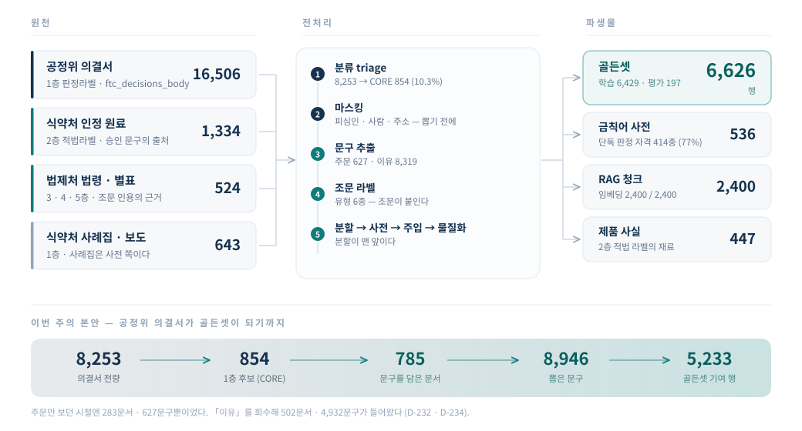

# 전처리 결과서 — 원문이 무엇이 됐나

> **SKN Final Project · 3팀 「한끗」 · CopyLane**
> **작성** 2026-09-17 KST · **작성자** 오한빈 (팀장) · **대상** 3W 제출

> 🚨 **수치의 정본은 이 문서가 아니다.** 모든 수는 [`docs/00_사실원장.md`](../00_사실원장.md)
> 의 「🆕 실측 (2026-09-17)」 절에서 왔다. 값이 바뀌면 **원장을 고치고 이 문서를 다시 만든다**
> (D-54 · D-90).
>
> ⬜ **이 문서는 아직 생성물이 아니다.** 손으로 썼다. 4W 에 `scripts/` 에 생성기를 붙여
> 「원장을 읽어 이 문서를 쓰는」 형태로 바꾼다 — 그때까지는 **두 벌이 갈릴 수 있다.**
>
> 🔴 **어느 상태의 수인가** (D-178) — 아래는 전부 **게이트 326 통과** 상태, **클론 B** 실측이다.
> 기기가 둘이고 `data/**` 는 커밋되지 않으므로 **한쪽 실측을 다른 쪽 사실로 쓰지 않는다**.
> §2 의 법령축 수만 **게이트 325 상태**(2026-09-16)이고 그렇게 표시했다.

---

## §1 한눈에

> 🚨 **이 그림은 생성물이 아니다** — 손으로 그렸다. 수는 아래 표와 §4 가 정본이다.

| 무엇 | 수 | 쓰임 |
|---|---:|---|
| **골든셋** | **6,626행** | 인코더 학습(T2) · 규칙 판정기 평가 |
| ↳ 학습 | 6,429 | |
| ↳ **평가(봉인)** | **197** | 🔴 유형 6종은 여전히 「측정 불가」 |
| **금칙어 사전** | **536종** | 룰 판정기 · 단독 판정 자격 414종(77%) |
| **RAG 청크** | 2,400 | 조문 인용 · 임베딩 2,400/2,400 (게이트 325 상태) |
| **제품 사실** | 447 | 2층 적법 라벨 |

---

## §2 원천 — 무엇이 들어왔나

**레지스트리 29종 중 원장에 오른 것 13종.** 나머지 16종은 판정이 끝났거나(보류 15 · 안 씀 13 ·
배제 10) 아직 안 받았다. 갈래별 현황은 생성물 [`데이터현황판.md`](데이터현황판.md) 가 낸다 —
**이 문서는 그 중 전처리를 지난 것만 다룬다.**

| 원천 | 층 | 원장 | 전처리 결과 |
|---|---|--:|---|
| `ftc_decisions_body` 공정위 의결서 | 1층 판정라벨 | 16,506 | **골든셋 5,233행** (이유 4,725 · 주문 508) |
| `mfds_hf_ingredient_board` 인정 원료 | 2층 적법라벨 | 1,334 | **골든셋 1,080행** — 적법 296 · 주입 784 |
| `mfds_casebook` 사례집 | 1층 판정라벨 | 2 | **골든셋 313행**(낱말) — 🔴 시험지가 아니라 **사전** 쪽이다 (D-155) |
| `law_go_kr` 법령·별표 | 3·4·5층 | 524 | 조문 2,207 · 별표 300 · 청크 2,400 |
| `cosmetic_ingredient` / `restricted` | 제품 사실 | 1,062 | `product_fact` 447 |
| `mfds_press` · `mfds_sanctions` · `mfds_special_use_guide` | 1층 | 643 | ⬜ 라벨 추출까지만 · 골든셋 미편입 |

**법령축** (🔴 **게이트 325 상태 · 2026-09-16** · D-178)

    조문 노드 2,207 (법령 20건) · 별표 노드 300 (파일 12)
    청크 2,400 — 일반 735 · 화장품 874 · 건기식 405 · 식품 386
    임베딩 2,400 / 2,400 (nlpai-lab/KURE-v1) · 모델 입력 토큰 최대 422 (512 초과 0행)
    조문 인용 붙은 청크 88.3% — ↳ 법령 86.9% · 별표 98.7%

---

## §3 전처리 다섯 단계

| | 단계 | 무엇을 한다 | 왜 이 순서인가 |
|---|---|---|---|
| 1 | **분류** `ftc_triage` | 8,253건을 A~E 로 가른다. `CORE = {A, A′, B, C}` **854건(10.3%)** | 전량을 마스킹·추출하면 시간과 오탐이 같이 는다 |
| 2 | **마스킹** `mask.apply_policy` | 피심인 상호 · 사람 이름 · 주소 · 상표 | 🔴 **뽑기 전에 지운다.** 뽑은 뒤 지우면 파생물에 원문이 한 번 앉는다 (D-17 · D-165) |
| 3 | **문구 추출** `phrases_in` | 인용부호 안의 광고 문구 | 잡음(`NOISE`)을 여기서 거른다 — 이유에서만 **14,214건** |
| 4 | **조문 라벨** `types_in` | 주문의 서술어에서 위반 유형 6종 | 🔴 **라벨을 사람도 모델도 붙이지 않는다.** 조문이 붙인다 |
| 5 | **분할 → 사전 → 주입 → 물질화** | 골든셋을 꾸린다 | 🔴 **분할이 맨 앞이다.** 사전이 먼저면 사전이 평가 문구로 만들어진다 (D-174) |

🚨 **정규화는 매칭 직전에만 한다** (D-117). 원천이 `·`·`ㆍ`·`.` 를 섞어 써서, 펴지 않으면
**8,253건 중 181건의 분류가 달라진다** — 1층 후보 기준 **들어온 것 135 · 나간 것 0**.

---

## §4 공정위 의결서 — 8,253건이 4,725행이 되기까지

**이번 주의 본안이다.** 종전에는 **주문(처분 문구)만** 봤고, 의결서의 광고 원문은 대부분
**이유**에 실린다. CORE 854건 중 **571건이 그래서 통째로 빠져 있었다** (D-232 · D-234).

| 칸 | 문서 | |
|---|---:|---|
| ① 주문 O · 이유 O | 269 | 종전에도 담김 |
| ② 주문 O · 이유 X | 14 | 종전에도 담김 |
| **③ 주문 X · 이유 O** | **502** | 🔴 **회수분** |
| ④ 둘 다 X | 69 | |

    담기는 문서  283 → 785 (2.77배) · 그 502문서가 주는 문구 4,932개

**이유 문구 8,319개가 4,725행으로 줄어드는 자리**

    이유 문구                    8,319
      − 조문 라벨이 없는 문서의 것   2,291   ← 221문서. 라벨이 없으면 학습에 못 쓴다
      − 봉인(평가) 문서의 것          850   ← 같은 문서가 학습과 평가 양쪽에 서지 않게
      = 필터에 들어간 것            5,178
      − 필터 다섯이 버린 것            453   ← ㅁ253 · ㄹ156 · ㄷ31 · ㄴ11 · 태그뿐2
      = 골든셋 이유 행         4,725

🔴 **이유는 주문과 섞지 않는다.** `구역` 열을 따로 두고 **학습에만** 넣는다 —
이유 문구의 라벨은 **문서 라벨을 내려 붙인 것**이고 전수 채택률이 39.7% 라, 평가에 넣으면
「조문이 붙인 라벨」이라는 전제가 깨진다 (D-172 · D-234).

✅ **회수가 덧붙이기였다는 증거** — train 위반이 는 수 **+4,725 가 이유 행 수와 정확히 같다.**
주문 999 · 적법 236 · 낱말 313 은 한 행도 안 움직였다.

⛔ **이유에서 *라벨*도 캘 수 있는가 — 쟀고, 안 캐기로 했다.** 유형어가 문서의 **78.2%**
(668/854)에서 뜨는데, 표본 30건을 채점하니 **처분·인정 판단은 4건(13%)**이고 나머지는
법 제3조 각 호 **조문 전문 인용**·법리 일반론·부정 문맥이었다. 라벨이 아니라 잡음이다.

---

## §5 골든셋 — 6,626행

| | train | test_sentence | 계 |
|---|---:|---:|---:|
| **행** | **6,429** | **197** | **6,626** |
| 위반 | 6,193 | 137 | 6,330 |
| **적법(음성)** | 236 | **60** | 296 |
| 단위 | 문장 6,116 · 낱말 313 | 문장 197 | |

**구역 × 출처**

| 출처 | 구역 | 분할 | 행 |
|---|---|---|---:|
| `real` | **이유** | train | **4,725** |
| `injected` | — | train | 784 |
| `real` | 주문 | train | 684 |
| `real` | 주문 | test_sentence | 137 |
| `approved` | 주문 | train | 118 |
| `approved` | — | train | 118 |
| `approved` | 주문 | test_sentence | 60 |

**원천별** — 골든셋 6,626행이 어느 원천에서 왔나

| 원천 | 행 | 내역 |
|---|---:|---|
| `ftc_decisions_body` | **5,233** | 이유 4,725 · 주문 371(train) · 주문 137(평가) |
| `mfds_hf_ingredient_board` | 1,080 | 주입 784 · 적법 296(train 236 · 평가 60) |
| `mfds_casebook` | 313 | 낱말 — 사전 쪽 (D-155) |

> 🚨 **`구역 = 주문` 은 「ftc 의결서의 주문」이 아니라 「이유가 아닌 것」이다.** 999행 안에
> ftc 주문 508 · 사례집 낱말 313 · 승인 문구 178 이 섞여 있다. 열 이름이 원천을 뜻하는 것으로
> 읽히기 쉬워 여기 적어 둔다 (D-160 — 두 계수기를 섞지 않는다).

**유형별** — 🚨 **두 가지 세는 법이 있다. 섞어 인용하지 않는다** (D-160)

| 유형 | 실사례만 (`구역` 있는 행) | 주입 포함 (train 집계) |
|---|---:|---:|
| 거짓_과장 | 4,658 | 4,812 |
| 소비자_기만 | 2,025 | 1,964 |
| 비방광고 | **245** | 355 |
| 질병_예방치료_표방 | 104 | 216 |
| 부당_비교광고 | **73** | 181 |
| 의약품_오인 | 57 | 169 |
| 후기_체험기_기만 | 0 | 112 |
| 건강기능식품_오인 | 87 | 87 |

★ **비방광고 245 · 부당_비교광고 73** — 여태 주입본뿐이던 두 유형에 **실물이 들어왔다.**
🔴 다만 **학습 표본이지 평가 표본이 아니다.**

다중 라벨 train **1,653행(25.7%)** · 평가 다중 라벨 **0**.

---

## §6 평가셋 — 197행, 그리고 「측정 불가」 6종

    거짓_과장 70 ✅  ·  소비자_기만 61 ✅
    🔴 부당_비교광고 4  ·  비방광고 2          ← 30 미만 = 측정 불가 (D-40)
    🔴 어느 단위로도 평가 데이터가 없는 유형 4종 —
       질병_예방치료_표방 · 의약품_오인 · 건강기능식품_오인 · 후기_체험기_기만

**206 → 197 로 준 9행은 손실이 아니라 누수 차단의 값이다.** 학습에 나타난 문구는 평가에서
뺀다. 이유를 학습에 넣자 겹치는 문구가 늘어 **문구겹침 제외가 8 → 17행**이 됐다.
**넣지 않았으면 그 9행은 답을 본 시험지였다.**

🔴 **D-40 의 「30」은 평가 표본에 건다.** 실사례가 245건 들어와도 비방광고의 평가는
**2행 그대로**다 — 이유 문구는 학습으로만 가기 때문이다. 이 넷을 세우려면 **사람이
라벨링해야 한다** (D-66). **이것이 남은 가장 큰 구멍이다.**

봉인은 **문서 단위**로 한다 — 같은 사건의 문구가 학습과 평가에 갈라 서면 문서 단위 분할이
무너진다. 평가에서 뺀 다중 라벨 문서 **97건**은 문구가 어느 호인지 안 적혀 있어서다.

---

## §7 사전 — 536종

    유형별 — 거짓_과장 393 · 소비자_기만 84 · 질병 60 · 건기식 58 · 의약품 39 · 비방 12 · 부당비교 1
    신뢰도 — 단독 판정 자격 414종(77%) · 모호 103 · 적법중첩 19
    길이 중앙 7자 · 10자 이상 190종 · 한 낱말이 여러 유형에 붙은 것 106종

🔴 **적법중첩 19종은 단독으로 위반 판정에 쓰지 않는다.**

    위반 「기억력」  ⊂  적법 「기억력개선에도움을줄수있음」
    위반 「면역」    ⊂  적법 「면역과민반응개선에도움을줄수있음」

✅ **사전은 오늘 한 종도 안 움직였다** — 재생성을 세 번 했는데 `sha256 e95327087e03` 이
세 번 다 같다. `dictionary.py` 가 주문만 읽고 이유를 안 읽기 때문이다.
⬜ **이유를 넣으면 ftc 337종 → 3,952종(11.7배) · 단독 판정 자격 72% → 67%.** 지금 넣지 않는다 —
단독 판정 경로라 종수가 11.7배면 **사람 검수가 못 따라간다** (D-156 · 4W).

---

## §8 주입 — 902건 (물질화 784행)

적법 문구를 규칙으로 위법화해 만든 합성 표본이다. **평가에는 넣지 않는다** — 합성으로
평가하면 「규칙을 배웠는가」를 재게 된다.

| 규칙 | 건 | 유형 | 고유 틀 |
|---|---:|---|---:|
| T1 완화구 삭제 | 112 | 거짓_과장 | **3종 (2%)** 🔴 |
| T2 기능성 → 질병명 | 112 | 질병_예방치료_표방 | 44종 (39%) |
| T4 의약품 어휘 삽입 | 112 | 의약품_오인 | 4종 (3%) |
| T5 최상급·절대 표현 | 112 | 거짓_과장 | 5종 (4%) |
| T6 후기 형식 | 112 | 후기_체험기_기만 | 5종 (4%) |
| T7a 경쟁사 부당 비교 | 112 | 부당_비교광고 | **3종 (2%)** 🔴 |
| T7b 경쟁사 비방 | 112 | 비방광고 | **3종 (2%)** 🔴 |

🚨 **틀이 한 자릿수다. 이대로 학습하면 「타사 제품보다」라는 말버릇을 배우지 위반을 배우지
않는다.** ⬜ 틀을 늘리는 것이 다음 작업이고, 재료는 ftc 근거절이다.
⬜ **T3(제품유형 오인)은 아직 없다** — 일반식품 문구가 있어야 만드는데 2층은 인정 원료뿐이다.

---

## §9 마스킹 — 무엇을 지우고 무엇을 안 지우나

**「업체명 마스킹」은 피심인을 뜻한다** (D-233). 경쟁사·거래처·인용된 회사는 대상이 아니다 —
그것을 지우면 **부당 비교·비방 광고의 판정 대상이 사라진다** (D-157).

| 지운다 | 안 지운다 |
|---|---|
| 피심인 상호(앵커 + 자리 + 맨몸 2패스) · 대표자·사람 이름 · 주소 · 괄호 안 원어 표기 | 제3자 상호 · 제품명 · 경쟁사명 · 인용 기관명 |

**이번 주에 고친 것** (D-235)

    ① 다중 피심인 — anchor_ftc 가 「A 및 B의 …」를 한 덩어리로 잘라 앵커가 무력했다
    ② 표기가 하나뿐 — 사건명은 「에스케이케미칼 주식회사」, 본문은 「제조원: SK케미칼」

| | 대상 안 실명 | 문구 | 주문 문구 |
|---|---:|---:|---:|
| 고치기 전 | 6 | 12 | 627 |
| 나열 쪼개기 | 4 | 8 | **627** |
| + 로마자 표기 | **3** | **7** | **627** |

✅ **주문 문구가 세 판 내내 627 로 붙박이다.** D-143 판 대조가 「마스킹이 판정 대상을 안
먹었다」를 증명한다. 마스킹 자국은 **453 → 464** 로 늘고 마스킹 총 길이는 **−76자** 줄었다.

⛔ **맨몸 상호를 전역 목록으로 지우지 않는다** (D-236). 부분 문자열 치환이라 낱말이 토막 난다 —
「제조원: SK케미칼」이 「제조원: **[업체]케미칼**」이 되어 **가리는 효과는 0인데 문구만 망가진다.**

---

## §10 알고 있는 결함 여섯

| | 무엇 | 크기 | 다음 |
|---|---|---|---|
| 1 | 🔴 **골든셋의 18.8%가 완전히 같은 텍스트** | **1,249행** (이유 796 · 주문 139) | ⬜ 제거·가중치·그대로 중 미판정 |
| 2 | 🔴 **평가셋 유형 6종이 「측정 불가」** | 비방 2 · 부당비교 4 · 나머지 4종 0 | 🔴 **사람이 라벨링해야 한다** (D-66) |
| 3 | 🔴 **주입 틀이 한 자릿수** | T1·T7a·T7b 각 3종 | ⬜ ftc 근거절에서 표현을 뽑아 채운다 |
| 4 | 🔴 **조문 라벨이 주문에서만 온다** | 221문서(CORE 의 25.9%)가 라벨 없어 통째로 버려짐 · 이유 문구 2,291개 | ⬜ 이유에서 캐면 정밀도 13% — 안 캔다 |
| 5 | 🟡 **피심인 실명 잔여** | 7문구 / 4,725 (0.15%) | ⬜ 앵커가 본문 표기보다 긴 경우 (D-235) |
| 6 | 🟡 **DB 가 파일보다 낡았다** | `golden_sample` DB 1,910 · 파일 6,626 | `db-reset --yes --data` 필요 |

🔴 **1 번이 가장 크다.** 반복 상위가 **과징금 고시 어구**(「중대한 위반행위」 26 ·
「대통령령으로 정하는 사항」 18 · 「청약철회등」 14)와 **진짜 광고 문구**(「EBS 스타강사」 10 ·
「학원생 ○○% 성적향상」 10 · 「대입진학자 ○○명」 10)로 갈린다. 필터 ㄹ 이 「…법」만 잡아
전자를 못 걸렀다. **회수 자체는 성공했다 — 학원 광고 문구가 뚜렷하게 들어왔다.**

---

## §11 안 본 것 (D-188)

- **회수한 4,725행이 실제로 광고 문구인가** — 표본 30건만 눈으로 봤다. 전수는 안 봤다
- **중복 1,249행을 어떻게 할지** — 제거하면 표본이 준다. 남기면 가중이 걸린다. **미판정**
- **다중 라벨 1,653행이 학습에 주는 영향** — 안 쟀다
- **비방광고 245 · 부당_비교광고 73 의 품질** — 수가 는 것만 봤고 내용은 안 봤다
- **`collect_manifest` 10,971 과 원장 고유 path 10,147 의 불일치 사유** — 09-16 부터 열려 있다
- **`search` p50 / p95 / p99** — 평균만 있다 · **리랭커 전후 델타** — 리랭커 미선정

## §12 다음 (4W)

1. **평가셋 4종을 사람이 세운다** — 이것 없이는 인코더 성능을 유형별로 못 낸다
2. **중복·법령 어구 처리를 판정한다** — §10 ①
3. **주입 틀을 ftc 근거절로 늘린다** — §10 ③
4. **사전에 이유를 넣을지 판정한다** — 넣으면 11.7배 (§7)
5. **이 문서에 생성기를 붙인다** — 원장을 읽어 쓰게 한다 (D-90)

---

> **근거 문서** — 수치 [`00_사실원장.md`](../00_사실원장.md) 「🆕 실측 (2026-09-17)」 ·
> 판정 [`00_설계결정기록.md`](../00_설계결정기록.md) **D-232 · D-233 · D-234 · D-235 · D-236** ·
> 원천 [`데이터현황판.md`](데이터현황판.md) · 거버넌스 [`판정매트릭스.html`](판정매트릭스.html)
