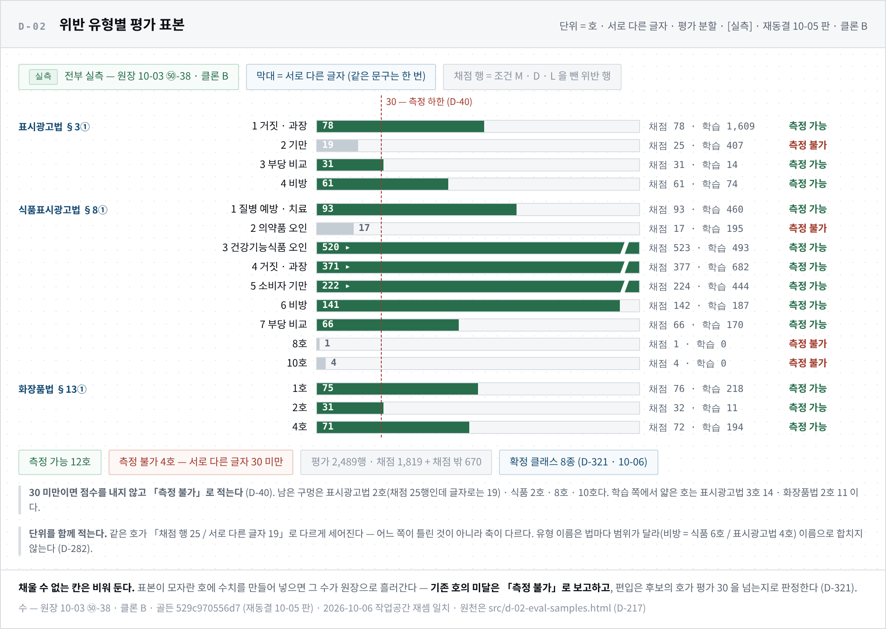

# 멀티 에이전트 테스트 계획 및 결과 보고서 — 팀장 작성분

> **공식 산출물** — 멀티 에이전트 테스트 계획 및 결과 보고서 (소스코드 포함)
> **작성** 2026-10-06 · 오한빈(팀장) · 기준 커밋 `21e4374`(ohb · 본문을 쓴 판) · 측정 커밋은 절마다 적는다 · 🔄 **최종 갱신** 2026-10-06 — 같은 날 뒤 커밋(`c7f483a` 까지 · `ssm` · `lse` 흡수)에 맞춰 §1-2 게이트 표 · §2 클론 A 실행 · §3-3-1 정답 수의 셈 · §5 를 고쳤다 · 🔄 `b0ad791` — §1-5 에 저장소 링크와 코드 발췌 · §3-3 앞에 도면 D-02 · §6(sLLM 파인튜닝 평가 · 팀원 작성분) 자리
> 🔴 **이 문서의 팀장 작성분(§1 ~ §5)이 다루지 않는 것** — 판정 인코더의 학습 · 평가 결과(박수진 · 소성민 보고서가 정본 · 3차 test 1 회 결과 대기) · sLLM 파인튜닝 평가(🔄 **팀원 작성분이 §6 으로 들어온다** — 지금 원천은 이서은 문서 `docs/lse/` · D-270 은 sLLM 을 「설계만」으로 정했고 상태 줄에 10-06 「전제 정정 · 결론 재검 대기」가 달렸다. 🔄 같은 날 `lse` 의 지적 문장 고쳐 쓰기(`POST /u/review/rewrite` → 로컬 sLLM 서버)가 `ohb` 에 병합됐고 **D-265 · D-270 과의 관계 · 승인 범위는 판정 대기**다) · 화면 테스트(고쳐 쓰기 화면의 테스트 파일이 있다는 사실만 §1-2 에 적는다)
> 이 문서가 다루는 것 — ① 판정 그래프를 무엇으로 어떻게 시험하나(계획) ② 게이트 테스트 결과 ③ 봉인 평가셋에서의 그래프 평가 결과 ④ 결과로 드러난 문제와 다음
> 🚨 **수치의 정본은** [`00_사실원장.md`](../00_사실원장.md) 10-02 ⑧ · ⑨ · 10-03 ㊿-30 · ㊿-39 · ㊿-40 이다 · **어느 상태의 수인가**(D-178) — 그래프 평가(§3-1 ~ §3-4)는 전부 **클론 B 집 기기** · 팀장 실행 출력 · 실제 DB · 검색 포함 · **인코더 없음** · 판정 `rule-0.3.0-dict` · 골든 `529c970556d7` · 사전 `455f8d7ea5c2` · 🔄 게이트(§2)는 클론 B 와 클론 A 의 실행을 기기를 적어 따로 싣는다 · 응답시간(§3-5)은 클론 A 다
> 🚨 **이 수는 인코더가 붙기 전의 기준선이다.** 낮은 재현율은 실패가 아니라 「사전만으로는 여기까지」라는 측정이다

---

## 1. 테스트 계획

### 1-1. 세 층으로 가른다

| 층 | 무엇을 보나 | 도구 | 언제 | 통과 기준 |
|---|---|---|---|---|
| **① 게이트 테스트** | 구조와 계약이 깨지지 않았나 — 라우팅 · 리듀서 · 계약 · 문안 글자 · 누수 방지 | `pytest -m gate`(`launcher.py check`) | 커밋마다 | 전부 통과 |
| **② 그래프 평가** | 판정이 정답과 얼마나 맞나 | `scripts/eval_graph.py` | 판정 규칙 · 사전 · 골든이 바뀔 때 | 게이트가 아니다 — 보고용 |
| **③ 응답시간** | 노드별 · 문장 수별 시간 | `scripts/time_graph.py` | 구조가 바뀔 때 | 판정 p95 3 초 미만(D-77) |

- ①은 **답이 기기마다 같아야 하는 것**만 본다. ② · ③은 데이터와 기기에 따라 답이 달라 게이트로 두지 않고 원장에 기기 · 커밋 · 골든 해시와 함께 적는다(D-178)

### 1-2. 게이트 테스트 — 그래프 쪽 파일

| 파일 | 건수 | 무엇을 지키나 |
|---|--:|---|
| `tests/test_graph_routers.py` | 46 | 라우터 함수를 그래프 없이 단독으로 · 컴파일본이 스텁과 같은 길을 간다 · 누적 키가 두 번 쌓이지 않는다 · 빈 팬아웃에서 멈춘다 · 병렬 법 노드의 결과가 다 쌓인다 · 스텁이 통과를 지어내지 않는다 |
| `tests/test_contracts.py` | 44 | 판정 계약 — 위반을 확정하면 근거 조문이 붙는다 · 통과는 확정이고 위험도가 가장 낮을 때만 · 확정 위반에는 불가 사유가 붙는다 · 픽스처가 계약으로 파싱된다 |
| `tests/test_contract_surface.py` | 3 | 계약이 조용히 바뀌면 잡는다 |
| `tests/test_judge_rule.py` | 22 | 판정 규칙 · 평가 도구의 채점 · 불가 사유 진단 · 보수 기록 지표 |
| `tests/test_judge_route.py` | 4 | 검수 종착 라우팅 |
| `tests/test_premise_branches.py` | 15 | 품목 분기 — 전제 표 · 기록 규칙 · 기준 문안이 승인본과 글자가 같다 |
| `tests/test_certificate.py` | 7 | 증명서 조립기 — 사유 문안이 승인본과 글자가 같다 · 문안 없는 조합은 증명서를 내지 않는다 |
| `tests/test_retrieve.py` | 33 | 검색 코어 — 모든 질의가 거버넌스 조인을 든다 · 저장된 벡터의 모델과 대조한다 · 순위 융합이 한쪽에만 있는 것을 버리지 않는다 |
| `tests/test_dictmatch.py` | 6 | 사전 매칭 — 좌표 · 정규화가 사전 빌더 · 판정기 B 와 같다 |
| `tests/test_dictionary_leak.py` | 7 | **평가셋이 판정 규칙을 고르지 못하게**(D-175) |
| `tests/test_sanction_rule.py` | 16 | 제재표 · 위험도 하한 |

- 건수는 2026-10-06 에 파일의 `def test_` 를 센 값이다(매개변수로 펼쳐지는 건수는 더 많다). 🔄 `c7f483a` 에서 다시 세어 열한 파일 모두 같다. 🚨 파일 안의 테스트가 전부 게이트인 것은 아니다 — gate 표시가 없는 함수가 `test_contracts.py` 에 2 · `test_judge_rule.py` 에 3 · `test_retrieve.py` 에 12 있다(`pytest --collect-only -m gate` 로 대조 · 저장소 사본). `check` 는 그 함수를 돌리지 않는다

🔄 **게이트 표시가 없는 테스트 — `launcher.py check` 가 돌리지 않는다**

| 파일 | 건수 | 무엇을 보나 | 실행 기록 |
|---|--:|---|---|
| `tests/test_api_judge.py` | 1 | 판정 API 가 검수 그래프를 부르고 응답을 계약으로 감싼다 | 원장에 따로 적힌 실행 기록을 찾지 못했다 |
| `tests/test_user_rewrite.py` | 17 (펼치면 30) | 검수 화면의 지적 문장 고쳐 쓰기 — sLLM 서버와 판정 코어를 가짜로 바꿔 끼워 본다: 판정의 `candidates` 는 비운 채다 · 위반 유형은 서버의 판정 결과에서 읽는다 · 서버가 없으면 후보를 그리지 않는다 · 고친 문구에 위반이 붙으면 후보가 아니다 · 깨진 sLLM 응답은 후보가 아니다 | 클론 A 기기 **30 통과**(원장 10-06 ② · 팀장 실행) |
| `tests/test_encoder.py` | 3 | 인코더 추론 모듈(`app/encoder.py`) — 라벨 틀(`label_scheme.json`)의 순서 · 문턱 읽기 · 라벨마다 제 문턱으로 후보를 고른다(모델 파일 없이 돈다) | 원장에 따로 적힌 실행 기록을 찾지 못했다 |

- `tests/test_api_judge.py` 는 게이트가 아니다 — 파일에 gate 표시(`pyproject.toml` 의 `gate` 마커)가 없고 집행계약 §1-3 색인에도 없다. 그래서 위 게이트 표에 싣지 않는다
- 🚨 고쳐 쓰기 화면은 게이트가 지키지 않는다 — `check` 가 초록이어도 이 화면이 깨졌을 수 있다(원장 10-06 ②). 게이트로 올릴지는 정하지 않았다
- 이 저장소 사본(`c7f483a` · 작업공간)에서 세 파일을 함께 돌리면 34 건이 통과한다 — 기기 실행이 아니다
- 게이트 파일의 전체 목록은 [`00_거버넌스_집행계약.md`](../00_거버넌스_집행계약.md) §1-3 이 정본이고 새 게이트 파일은 같은 커밋에 그 표에 한 줄 보탠다
- **픽스처** — `tests/fixtures/judge/` 15 건(통과 · 보류 사유별 · 증명서 A · C · 지시 · 근거 없음 · 미판정 · 품목 분기 셋 · 미검수 법). 계약 게이트가 이 픽스처를 전부 파싱한다
- **게이트를 고치면 일부러 깨뜨려 본다** — 항상 통과하는 단언은 검사가 아니다(D-170)

### 1-3. 그래프 평가 — 시험지와 채점 규칙

| 항목 | 값 |
|---|---|
| 시험지 | 골든셋의 봉인 평가 분할(`test_sentence`) — 학습 · 사전 · 규칙을 만드는 데 쓰지 않은 행 |
| 두 번 잰다 | **무조건부**(품목을 모른다 · 세 법 전부) · **조건부**(골든의 품목을 제품 정보로 넘긴다 · 품목을 아는 행만)(D-306) |
| 예측으로 세는 것 | **확정 문장의 위반만** — 보류 · 근거 없음 · 미판정은 예측이 아니다 |
| 채점에서 빼는 행 | 조건 D(판정 대상 아님) · M(맥락이 있어야 판단)(D-286) |
| 셈 단위 | 호 — 정답 30 미만은 「측정 불가」로 적는다(D-40 · D-282) |
| 채점 규칙 | 판정기 B(`scripts/eval_rule.py`)와 **한 곳** — 같은 자로 잰다(D-99) |

지표는 일곱이다.

| # | 지표 | 뜻 |
|:-:|---|---|
| 1 | 응답 분포 · 보류율 | 종착과 문장 판정 상태 — 보류는 **사유별로** 센다(D-269) |
| 2 | 유형 · 호별 정밀도 · 재현율 | 확정한 위반이 정답 호와 맞나 |
| 3 | coverage · selective risk | 판정을 내린 행의 비율 · 그중 틀린 비율 — 둘을 쌍으로 본다(D-77) |
| 4 | 확정 재현율 · 탐지 재현율 | 위반 행 중 확정한 비율 · 확정하거나 후보로 실은 비율 |
| 5 | 적법 문장 오탐 | 적법 문장을 위반으로 확정한 수 — 내역(주장 있음 · 없음)과 함께만(D-301) |
| 6 | 보수 기록 | 확정 ∪ 전제를 몰라 멈춘 문장에 실린 위반을 「기록된 판정」으로 센다(D-263 ①) |
| 7 | 불가 사유 진단 | 확정 위반의 사유(A · B · C)를 라벨의 조건과 대조 — 게이트 아님 |

### 1-4. 누수를 막는 규칙

1. **봉인 평가셋으로 규칙 · 문턱을 고르지 않는다**(D-175) — 평가 수는 보고용이다. 규칙을 고칠 때는 학습 분할에서만 잰다
2. 사전의 단독 판정 자격 심사에는 학습 쪽 자료만 쓴다 — 게이트가 본다(`tests/test_dictionary_leak.py`)
3. 평가 결과 파일을 읽어 원인을 볼 때는 「진단」이라 적고 그것으로 규칙을 바꾸지 않는다
4. 실행하지 않은 것은 「미실행」으로 적는다 — 예측은 예측이라 적고 재실행으로 확인한다

### 1-5. 소스코드

| 무엇 | 어디 |
|---|---|
| 판정 그래프 | `app/graph.py` · `app/premise.py` · `app/reasons.py` · `app/dictmatch.py` · `app/retrieve.py` · `app/sanction.py` |
| 계약 | `app/contracts.py` |
| 평가 도구 | `scripts/eval_graph.py` · `scripts/eval_rule.py` · `scripts/time_graph.py` |
| 게이트 | `tests/` — §1-2 |
| 실행 | `uv run python launcher.py check` · `uv run python scripts/eval_graph.py --out <파일>` · `uv run python scripts/eval_graph.py --conditional --out <파일>` |

- 평가 결과 파일은 `build/eval/` 에 쓴다(git 밖 생성물). 골든셋은 재배포 제약이 있어 공개 git 에 없다 — 공유 저장소로 받는다(D-249)

**저장소** — <https://github.com/SKNETWORKS-FAMILY-AICAMP/SKN32-FINAL-3TEAM> (브랜치 `ohb` · 이 절의 발췌는 커밋 `b0ad791`). 아래는 발췌이고 전문은 위 표의 경로에 있다.

코어의 순서는 표 하나가 정한다 — 컴파일한 그래프와 테스트가 같은 표를 읽는다 (`app/graph.py`).

```python
CORE_BEFORE_LAWS = ("split", "classify", "retrieve", "match_dict", "encode")
CORE_AFTER_LAWS = ("merge_laws", "judge", "assess_risk", "premise_branches", "doc_rules")
```

검수의 종착은 우선순위 **보류 > 증명서 > 지시 > 통과**다 — 하나라도 확정이 아니면 보류이고, 위험도 없는 확정 위반은 증명서 · 지시로 가지 못한다 (`app/graph.py` `route_review` · 주석은 줄였다).

```python
def route_review(state: ReviewState) -> str:
    sents = state.get("sentences", [])
    if not sents:
        return "hold"
    if any(s.verdict is not Verdict.confirmed for s in sents):
        return "hold"
    if any(s.violations and s.risk.final is None for s in sents):
        return "hold"
    reasons = {s.infeasibility for s in sents if s.infeasibility}
    if reasons & {Infeasibility.A, Infeasibility.C}:
        return "certificate"
    if Infeasibility.B in reasons:
        return "guidance"
    ...  # 통과는 확정 ∧ R0 일 때만 (D-273)
```

게이트 테스트는 이 규칙들을 고정한다 — 「사전에 안 걸렸다」가 통과가 아니라 보류라는 것(`tests/test_judge_rule.py`), 분기 노드가 위험도 뒤에 서고 그 출력이 코어 밖으로 나간다는 것(`tests/test_premise_branches.py`).

```python
@pytest.mark.gate
def test_사전에_안_걸리면_보류다() -> None:
    s = _one(_state("하루 한 포", []))
    assert s.verdict is Verdict.hold and s.hold_reason is HoldReason.low_conf
    assert not s.violations


def test_분기_노드가_코어_순서와_출력에_들어_있다() -> None:
    assert "premise_branches" in CORE_AFTER_LAWS, "분기 노드가 코어 순서에 없다 (D-319)"
    assert CORE_AFTER_LAWS.index("assess_risk") < CORE_AFTER_LAWS.index("premise_branches"), (
        "분기는 위험도 뒤에 선다 — 같은 문장을 바꿔 끼운다"
    )
    assert "branches" in CORE_OUT, (
        "🚨 `branches` 가 코어 출력에 없으면 검수 그래프가 분기를 못 받는다 (오류 없이 빈 목록)"
    )
```

## 2. 결과 ① — 게이트 테스트

| 시점 | 커밋 | 결과 | 무엇이 들어온 뒤인가 |
|---|---|---|---|
| 10-05 | `d592072` 직전 | 1,355 passed · 2 skipped | 품목 분기 1 판 · 사유 진단 칸 |
| 10-06 | `6d84bc0` | 1,356 passed · 2 skipped | 기준 문안 승인 · 분기 켬 |
| 10-06 | `8dff824` | **1,363 passed** · 2 skipped | 증명서 조립기 · 보수 기록 지표 |
| 🔄 10-06 · **클론 A** | `9943002` | 1,363 passed · 2 skipped · 779 deselected | 재동결 10-05 판 받기 · `migrate` 0024 · 적재 뒤(원장 10-06 ①) |
| 🔄 10-06 · **클론 A** | `68ae677` 뒤(`dc410b5` 의 코드) | 1,363 passed · 2 skipped · 809 deselected | `ssm` · `lse` 흡수 뒤(원장 10-06 ②) — 통과 수가 같다: 흡수로 들어온 테스트에 gate 표시가 없다 |

- 위 세 줄은 클론 B 집 기기 · 아래 두 줄은 클론 A 회사 기기 · 모두 팀장 실행 출력 · `launcher.py check`. 두 기기의 수가 같지만 기기 축이라 따로 적는다. 🚨 `check` 는 게이트 표시가 붙은 테스트만 돈다 — 게이트가 아닌 테스트와 커밋 훅은 따로다
- 클론 B 에서는 `8dff824` 뒤의 커밋 둘(`aaef67d` · `21e4374`)이 문서뿐이라 다시 돌리지 않았다(미실행) · 🔄 `lse` 흡수 뒤의 판(`c7f483a`)은 클론 B 에서 아직 돌리지 않았다(미실행)
- 테스트가 잡아 낸 것(10-06) — 분기를 켜자 `tests/test_graph_routers.py` 9 건이 실패했다. 분기 노드가 걸린 낱말이 없을 때도 제재표를 읽으려 한 것이다 → 적중이 없으면 읽지 않게 고쳤다

## 3. 결과 ② — 그래프 평가 (봉인 평가셋 · 인코더 없음)

### 3-1. 지금 판 (커밋 `8dff824` · 원장 10-03 ㊿-39 · ㊿-40 보충 1)

| | 무조건부 | 조건부 |
|---|--:|--:|
| 평가 행(채점 행) | 2,489 (1,819) | 2,225 (1,599) |
| 종착 — 증명서 · 보류 | 0 · 2,489 | **21** · 2,204 |
| 확정 위반 행 | 6 | 56 |
| 전제를 몰라 멈춘 행 | `cat_unknown` 89 | `premise_unknown` 27 |
| coverage | 0.3% | 2.8% (44 / 1,599) |
| selective risk | 83.3% (6 행 중 5) | 22.7% |
| 확정 재현율 | 0.1% | 2.5% |
| 탐지 재현율(확정 ∪ 후보) | 16.1% | 17.0% |
| 적법 문장 오탐 | **0 / 143** | **0 / 133** |
| 보수 기록 — 기록 행 중 틀림 | 25 / 86 (29.1%) | 18 / 75 (24.0%) |

- 조건부는 승인 문구 규칙으로 만든 행 42 를 뺀 수다 — 그 행의 품목은 원천이고 라벨은 「일반식품이 쓰면」이라는 보수 전제라 조건부 채점에 맞지 않는다
- 무조건부의 확정 6 행은 수로 말하기에 작다 — selective risk 83.3% 는 6 행 중 5 다
- 실행 시간 — 무조건부 815 초(행당 328 ms) · 조건부 749 초(337 ms)

### 3-2. 바뀌어 온 길

| 판 | 무엇이 바뀌었나 | 무조건부 확정 위반 | 조건부 확정 위반 | 종착 |
|---|---|--:|--:|---|
| 기준선(㊿-30 · `8a5e9a7`) | 재동결 10-05 판 · 분기 없음 | 95 | 86 | 전부 보류 |
| 분기 켬(㊿-39 · `6d84bc0`) | 품목을 모르면 전제마다 같을 때만 확정 | 6 + `cat_unknown` 89 | 58 + `premise_unknown` 28 | 전부 보류 |
| 조립기(㊿-40 보충 1 · `8dff824`) | 증명서 사유 문안 · 조립기 | 6 | 56 | 조건부에 증명서 21 |

- **분기는 판정의 상태만 바꾼다** — 탐지 재현율과 적법 오탐은 세 판에서 그대로다. 품목을 모를 때 사라진 확정은 정답 품목의 분기 안에 남아 있다(무조건부 — 그 분기의 확정 78 행 · 유형 맞음 57 · 틀림 21)
- **예측과 실측이 맞았다** — 분기를 켜기 전에 「95 → 6 + 89」를, 조립기를 넣기 전에 「증명서 21」을 적어 두고 재실행으로 확인했다



> 도면 D-02 (2026-10-06 판 · 원장 10-03 ㊿-38 · 클론 B · 재동결 10-05 판) — 호마다 평가 표본이 얼마나 있는지다. 막대는 **서로 다른 글자** 수라 아래 표의 정답 행 수와 단위가 다르다(§3-3-1 의 셈 설명). 30 미만인 네 호는 측정 불가다(D-40).

### 3-3. 호별 (기준선 ㊿-30 · 무조건부 · 정답 30 이상 · 🚨 분기를 켜기 전의 판)

| 호 | 정밀도 | 재현율 |
|---|--:|--:|
| 식품표시광고법 제8조① 1호 | .909 | .213 |
| 5호 | 1.000 | .051 |
| 3호 | .714 | .038 |
| 4호 | .438 | .017 |
| 표시광고법 제3조① 1호 | .500 | .013 |

- 재현율이 0 인 호가 일곱이다 — 표시광고법 3호 · 4호 · 화장품법 제13조① 1호 · 2호 · 4호 · 식품표시광고법 6호 · 7호
- 사전에 **화장품법 인용 항목이 0** 이다(원장 10-03 ㊿-31) — 화장품법 호의 재현율 0 은 그 결과다

### 3-3-1. 호별 — 분기를 켠 뒤 (커밋 `8dff824` · 클론 B · 결과 파일 `build/eval/graph_1006b*.json` 의 요약을 읽음 · 정답 수는 **평가 도구가 센 행 수** · 🚨 원장에 옮겨 적지 않은 수다)

| 호 | 무조건부 | 조건부 |
|---|---|---|
| 식품표시광고법 제8조① 1호 | 맞음 0 | 정답 94 · 정밀도 .909 · 재현율 .213 |
| 5호 | 맞음 0 | 정답 236 · 1.000 · .051 |
| 4호 | 맞음 0 | 정답 418 · .455 · .012 |
| 3호 | 맞음 0 | 정답 487 · **맞음 0** |
| 2호 | 맞음 0 | 정답 17(측정 불가) · 맞음 3 |
| 표시광고법 제3조① 1호 | 정답 78 · .500 · .013 | 표에 없다(품목이 없는 행이라 조건부에서 빠진다) |

- 무조건부에서 0 이 아닌 호는 표시광고법 1호 하나다 — 나머지 확정이 `cat_unknown` 보류로 옮겨 갔다
- 조건부의 식품 3호는 기준선의 재현율 .038 에서 0 이 됐다 — 일반식품 기능성 전제가 3호를 판정하지 못해 식품 품목의 3호 적중이 전부 보류가 된다
- 그 밖의 호(표시광고법 2 ~ 4호 · 화장품법 세 호 · 식품표시광고법 6 · 7호)는 두 판 모두 맞음 0 이다
- 🔄 **이 표의 「정답」은 [`모델링_및_평가.md`](모델링_및_평가.md) §3-1 의 호별 수(식품 1호 93 · 3호 520 · 4호 371 · 5호 222)와 다른 셈이다** — 틀린 수가 아니다. 저쪽은 `근거` 칸이 찬 채점 행을 **서로 다른 글자**로 센 것이고(원장 10-03 ㊿-38 · D-40 의 30 을 거는 단위), 이 표는 평가 도구(`scripts/eval_graph.py` `summarize` · `scripts/eval_rule.py` `truth_ho`)가 **행으로** 세되 근거가 후보로만 있는 72 행도 정답에 넣고(후보 가운데 예측과 가장 겹치는 것) 조건부에서는 승인 문구 42 행(전부 3호)을 뺀 것이다. 그래서 4호 418 · 5호 236 은 `근거` 칸만 센 행 수(377 · 224)보다 크고 3호 487 은 작다
  - 골든 파일(`529c970556d7`)에 같은 정답 규칙을 예측 없이 대면 조건부 1호 93 · 3호 487 · 4호 418 · 5호 236 · 2호 17 이 나온다(작업공간 재현) — 1호의 94 는 후보 근거 행 하나가 예측에 맞춰 1호로 세진 것으로 읽힌다. ⬜ 결과 파일은 클론 B 에만 있어 그 한 행은 확인하지 못했다
  - 🚨 D-40 의 측정 가능 여부는 서로 다른 글자로 본다 — 이 표의 행 수로 판단하지 않는다

### 3-4. 증명서 21 행의 내역 (진단 · 조건부)

| 내역 | 행 |
|---|--:|
| 유형이 라벨과 맞고 조건도 절대형 | 16 |
| 조건은 절대형인데 라벨의 유형 칸이 빔 | 1 |
| **증명서가 나가면 안 되는 문장** — 조건 D 2 · 조건 M 1 · 정답이 다른 유형 1 | **4** |

- 21 행은 수로 말하기에 작다. 원인은 사유 문안이 아니라 **사전 낱말이 주장이 아닌 문장에 걸리는 것**이다 — 주장 여부는 인코더가 가린다(D-275)
- ⚠️ 인코더가 붙기 전의 증명서를 어떻게 낼지는 판정 대기다

### 3-5. 응답시간 (원장 10-02 ⑧ · ⑨ · 🚨 **클론 A** · 커밋 `2f5bb32` · `98a5b52` · 품목 미확정 · 인코더 · 리랭커 없음)

| 원고 문장 수 | 전체 p50 | 전체 p95 | 목표(p95 3 초) |
|---|--:|--:|---|
| 1 | 347 ms | 654 ms | 안 |
| 5 | 1,804 ms | 2,217 ms | 안 |
| 10 | 3,046 ms | 4,350 ms | 넘음 |
| 20 | 5,966 ms | 6,547 ms | 넘음 |

- 시간의 91 ~ 98% 가 조문 검색이고 그중 73% 가 임베딩 계산이다. 법별 노드 셋의 합은 1% 안팎이다
- 🚨 분기 노드 · 증명서 조립기가 들어오기 전의 수다. 그 뒤로 응답시간은 다시 재지 않았다 — 평가의 행당 시간이 264 ms 에서 328 ms 로 늘었는데 원인은 확인하지 않았다

## 4. 결과가 말하는 것

| # | 드러난 것 | 근거 | 다음 |
|:-:|---|---|---|
| 1 | **사전만으로는 위반의 여섯 중 하나만 건드린다** | 탐지 재현율 16 ~ 17% | 인코더 배선 — 이 수가 인코더가 넘어야 할 선이다 |
| 2 | **적법 문장을 위반으로 확정하지 않는다** | 오탐 0 / 143 · 0 / 133 | 인코더가 붙은 뒤에도 유지되는지 같은 자로 잰다 |
| 3 | 확정한 것의 넷 중 하나쯤은 틀린다 | selective risk 22.7% · 보수 기록 틀림 24 ~ 29% | 사전 재작업(D-313) — 호 재부여 · 목 부여 |
| 4 | 주장이 아닌 문장에 낱말이 걸린다 | 증명서 21 행 중 4 · 채점 밖 확정 | 인코더의 주장 판별 · 의무 고지문 거르기 |
| 5 | 「실증하면 된다」는 사유의 절반이 라벨과 방향이 다르다 | 불가 사유 진단 — 조건부 50 행 중 25 | 사유는 유형이 아니라 표현 부류에 달렸다 — 사전 재작업 때 |
| 6 | 식품 품목의 3호는 구조적으로 보류다 | 일반식품 기능성 전제가 3호를 판정하지 못한다 | 기능성 범위 대조기 |
| 7 | 10 문장 안팎에서 응답시간 목표를 넘는다 | §3-5 | 임베딩 비용 — 판정 대기 |

## 5. 한계 — 이 보고서가 말하지 못하는 것

- **인코더가 붙은 그래프의 수가 없다** — 멀티 에이전트로서의 통합 성능(인코더 + 사전 + 법별 노드)은 배선 뒤에 잰다
- **생성 경로는 시험하지 않았다** — 판정 그래프의 생성 노드가 비어 있고 `POST /generate` · `/compose` 는 501 이다. 라우터와 방문 순서만 게이트가 본다. 🔄 10-06 에 병합된 검수 화면의 고쳐 쓰기(`POST /u/review/rewrite`)는 그래프 밖의 화면 경로다 — 테스트 파일은 있으나(`tests/test_user_rewrite.py` · sLLM 서버는 가짜) gate 표시가 없고, 실제 모델 출력의 품질은 이 보고서가 재지 않았다. 승인 범위는 판정 대기다
- 평가 분할에 정답 30 미만인 호가 넷 있다(표시광고법 2호 · 식품표시광고법 2호 · 8호 · 10호) — 그 호는 측정 불가다(원장 10-03 ㊿-23 · ㊿-38)
- 평가의 원천이 쏠려 있다 — 식품은 해설서 중심이다
- 평가의 「유형 없는 위반」 131 행 — 정답 유형이 비어 있어 **「위반 행」 분모에서 빠진다**(위반 행 1,750 은 이 131 행을 뺀 수다) · 그중 59 행은 근거 호가 있어 호별 표의 정답에는 든다(유형 표와 호 표의 분모가 다르다) · 지금은 131 행이 전부 보류라 selective risk 에 닿지 않는다 · 🔴 **인코더가 이 행을 위반으로 확정하면 「정답 유형 없음 + 예측 있음」이라 오답으로 센다** — 배선 전에 채점 규칙을 정한다(`scripts/eval_graph.py` 를 읽고 결과 파일 `graph_1006b.json` 과 골든을 맞대어 셈 · 2026-10-06 · 클론 B · 조건 A 14 · B 57 · C 60)
- 🔄 그래프 평가의 수는 전부 한 기기(클론 B)의 실측이다. 응답시간은 클론 A 다. 게이트는 10-06 에 두 기기에서 따로 돌았고(클론 B `8dff824` · 클론 A `9943002` · `68ae677` 뒤 — 둘 다 1,363 passed · 2 skipped) 기기를 적어 나란히 실었다(§2) — 기기를 섞어 견주지 않는다
- 동시 요청 · 배포 기기에서의 응답시간은 재지 않았다

## 6. sLLM 파인튜닝 평가 결과 — 팀원 작성분

> ⬜ **이 절은 팀원이 작성한다** (2026-10-06 · 팀장 확인). 이 과제(3번 주제)는 테스트 보고서에 sLLM 파인튜닝 평가 결과를 싣도록 요구한다.
> 작성분을 이 절에 넣을지, 별도 문서로 두고 여기서 가리킬지는 받은 뒤 정한다. 그때까지 이 절은 비어 있다 — 수치를 미리 옮겨 적지 않는다.

- 지금의 원천 — sLLM `docs/lse/`(파인튜닝 결과서 · 시연 세트 · 학습 · 평가 스크립트) · 판정 인코더 `docs/ssm/` · `docs/psj/`. 개인 폴더의 문서이고 이 보고서의 수(§2 ~ §3)와 시험지 · 기기가 다르다
- §1 ~ §5 의 수는 **인코더도 sLLM 도 없이** 잰 판정 그래프의 수다. 이 절이 채워져도 그 수는 바뀌지 않는다
- ⚠️ 검수 화면의 고쳐 쓰기(sLLM)와 D-265 · D-270 의 관계 · 승인 범위는 판정 대기다(D-270 은 「전제 정정 · 결론 재검 대기」) — 이 절에 싣는 평가가 「동작하는 기능」의 평가인지 「파인튜닝 결과」의 요약인지는 그 판정을 따른다

> **근거** — 수치 [`00_사실원장.md`](../00_사실원장.md) 10-02 ⑧ · ⑨ · 10-03 ㊿-23 · ㊿-30 · ㊿-31 · ㊿-36 · ㊿-38 · ㊿-39 · ㊿-40 · 10-06 ① ② · 코드 `scripts/eval_graph.py` · `scripts/eval_rule.py` · `scripts/time_graph.py` · `tests/` · 판정 [`00_설계결정기록.md`](../00_설계결정기록.md) D-40 · D-77 · D-99 · D-170 · D-175 · D-178 · D-249 · D-263 · D-265 · D-269 · D-270 · D-275 · D-282 · D-286 · D-301 · D-306 · D-313 · 게이트 지도 [`00_거버넌스_집행계약.md`](../00_거버넌스_집행계약.md) · 구조 [`../02_설계/AI_시스템_아키텍처.md`](../02_설계/AI_시스템_아키텍처.md)
